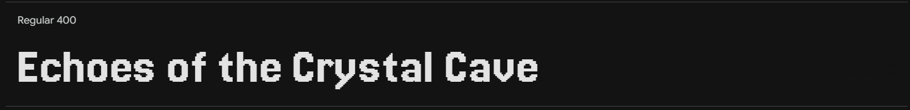

# Echoes of the Crystal Cave
#### A pixel art memory game


#### About:

This game takes the classic Simon and Bop It style memory challenge and gives it a unique twist with a cave setting, atmospheric audio, and a five-note scale system. Players interact with glowing crystals that light up and produce musical tones when activated. The game is designed to be accessible, engaging, and visually appealing, with pixel-art aesthetics and simple, responsive controls.

[View Live Site.](https://seren-hughes.github.io/crystal-cave/) Hosted on GitHub Pages.

#### Key Features:

--- 

## Table of Contents:
- [Objectives](#objectives)
- [User Stories](#user-stories)
- [Design & Planning](#design--planning)
- [Game Mechanics](#game-mechanics)
- [Wireframes](#wireframes)
- [Pseudocode](#pseudocode)
- [Function Structure](#function-structure-and-game-pseudocode-refined)
- [Typography](#typography)
- [Colour Palette](#colour-palette)
- [Technologies Used](#technologies-used)
- [Features](#features)
  - [Home Page](#home-page)
  - [Game Page](#game-page)
  - [UI Navigation](#ui-navigation)
  - [Speech Bubble Modal](#speech-bubble-modal)
  - [Audio & Audio Controls](#audio-audio-controls)
  - [How to Play Modal](#how-to-play-modal)
  - [Game Dashboard Modal](#game-dashboard-modal)
  - [Game Over Modal](#game-over-modal)
  - [Freestyle Mode](#freestyle-mode)
  - [Error Page](#error-page)
  - [Additional Features](#additional-features)
- [Deployment](#deployment)
- [JavaScript JSDoc Documentation](#javascript-jsdoc-documentation)
- [Testing](#testing)
- [Future Enhancements](#future-enhancements)
- [Credits](#credits)
- [Acknowledgements](#acknowledgements)

## Objectives:

**Target Audience:**
- Casual gamers who enjoy quick, skill-based challenges.
- All age groups, from children to adults, due to simple controls and gameplay.
- Fans of retro and pixel art games looking for a nostalgic yet fresh experience.
- Fans of music based games.
- Fans of memory games and memory training games (music memory included).

## User Stories

### Gameplay & Progress
- As a player, I want to start a new game easily, so I can quickly begin playing.
- As a player, I want to see my progress and highest level, so I can track and improve my performance.
- As a player, I want visual and audio feedback for correct and incorrect actions, so I understand my progress and mistakes.
- As a player, I want the crystals to light up and play sound when I interact with them, so I know my input was registered.

### Instructions & Accessibility
- As a new player, I want clear, simple instructions, so I can understand the game quickly.
- As a player, I want accessible controls (mouse, keyboard, touch), so I can play on any device.
- As a player, I want clear icons or tooltips for each button, so I understand their purpose even without text.

### Navigation & Settings
- As a player, I want clear, accessible buttons to restart, return home, view instructions, and access settings, so I can easily control my experience.
- As a player, I want to toggle full-screen mode and sound, so I can play comfortably in different environments.
- As a player, I want to delete my saved progress, so I can start fresh whenever I choose.
- As a user, if I land on a broken or missing page, I want to see a friendly 404 message and a clear way to return to the homepage.

### Personalisation & Persistence
- As a player, I want to enter a username and receive personalised messages, so the game feels more engaging.
- As a returning player, I want my progress (like highest level) to be saved locally, so I can aim to improve over time.

### Audio & Immersion
- As a player, I want to hear ambient cave sounds and background music, so the game feels immersive.
- As a player, I want to adjust or mute the game’s audio, so I can customise the experience to suit my environment.

### Freestyle Mode (Bonus)
- As a player, I want to play the crystal notes freely, so I can experiment with the sounds and enjoy them outside of the main game.

---

# Design & Planning

### Game Overview:
Echoes of the Crystal Cave is a memory-based puzzle game where players help Brucey the bat navigate a mysterious cave filled with glowing, musical crystals. Players must watch and listen to and repeat sequences of notes to progress, while enjoying a dynamic audio-visual experience.

### Concept:
Help Brucey the bat remember the sequence of crystals. 

### Game Mechanics:
#### Controls:
- **Mouse Click** – Click on the crystals to play their notes.
- **Touch Screen Tap** – Tap crystals on mobile for touch interaction.
- **Keyboard Keys (A, W, S, E, D)** – Alternative input for accessibility.
#### Visual & Audio Cues:
- Crystals glow in different colours when activated.
- Each crystal plays a distinct note in a five-note scale.
- Correct sequence all crystals glow and a rewarding sound plays before the next level sequence starts.
- Incorrect sequence results in modal pop up with encouraging 'try again' messages (_could have random inspiring messages_) and option to play again yes/no buttons. 

#### Win Conditions:
- Successfully repeat the full sequence to advance to the next round.

#### Lose Conditions:
- In Hard/Default Mode, a single mistake results in a game over. 
- _(could have feature)_ Easy Mode, players have three chances before restarting.

#### Could have features:
- **Easter egg** - Player name input. If name is equal to Brucey, Brucey the bat changes colour or wears a hat. 

#### Level Design & Sequence Length:
1. Level 1 = sequence of 3
2. Level 2 = sequence of 4
3. Level 3 = sequence of 5 
... and so on.


#### Reference Images:
- Music notes/scale and crystal colour correspondence layout:


#### Layout sketches:
The game is designed to be intuitive and accessible across multiple devices:
#### Game inspiration: 
Brucey the plush bat, who inspired the creative process behind the game’s theme. 


## Wireframes

1. ### Index / Home Page:


2. ### Instructions Modal View:


3. ### Game Page:


4. ### Landscape View Small Devices:


5. ### Greetings / Ready? Modal:


6. ### Game Page Modal View:


7. ### 404 Error Page:


## Pseudocode 

Basic pseudocode was used during the early planning and development stage. It was helpful to write out the basic logic in order to visualise the game layout and html div containers needed in order to make dynamic changes to each componant. 

### Game Initialization:

- Start the game when the player clicks "Start".
- Set the initial level to 1.
- Determine sequence length based on the level (Level 1 = 3, Level 2 = 4, Level 3 = 5 etc.).
- Generate a random sequence of numbers (1 to 5), each representing a crystal.
- Store the sequence.
- Display (play) the sequence by making the corresponding crystals glow and play their notes.

### Player Input:

- Wait for the player to start inputting their sequence by clicking on crystals.
- Store each clicked crystal in an array in the order they are clicked.
- After the player has entered the full sequence, compare it to the generated sequence.

### Sequence Validation:

- _**If the player's input matches the generated sequence:**_
  - Play a success animation (all crystals glow, twinkly music plays).
  - Increase the level.
  - Generate a new sequence with an increased length.
  - Display the new sequence.

- _**If the player's input does not match:**_

  - Display "Game Over" modal with retry option.
  - Option to restart from Level 1.

### Additional Features:

- Implement difficulty modes (e.g., limited attempts in hard mode/lives in easy mode/faster sequence speed).
- Add settings like brightness and sound control.
- Store player progress (e.g., name and highest level reached) in local storage.
- Easter egg for special player name (e.g., "Brucey" replace bat pixel sprite).

## Function Structure (and game psuedocode refined)

1. `startGame()`

    - Resets level to 1
    - Generates an initial sequence of 3 crystals
    - Displays the sequence to the player

2. `storeSequence()`

    - Generates a random sequence of crystal notes for each level
    - Ensures each level has a completely new sequence (level + 2)

3. `playSequence()`

    - Loops through the stored sequence
    - Makes each crystal glow and plays the corresponding note

4. `waitForPlayerInput()`

    - Captures player clicks, keyboard keys / A,W,S,E,D / touch, on crystals
    - Stores their input sequence

5. `checkPlayerInput()`

    - Compares player’s input with the stored sequence
    - If correct: calls `nextLevel()`
    - If incorrect: calls `showPlayAgainModal()`

6. `nextLevel()`

    - Increments level by 1
    - Calls `storeSequence()` to generate a new, longer sequence (by 1)
    - Calls `playSequence()` to show the new sequence

7. `showPlayAgainModal()`

    - Displays a modal asking if the player wants to retry
    - If "Yes": Calls `startGame()` to reset
    - If "No": Ends the game - return to home page

### Early Planning & Visualisation

To help plan and understand the logic for my project, I wrote out basic pseudocode and used [Python Tutor](https://pythontutor.com/) to visualise how my functions and arrays would work. This approach, learned during my course, made it much easier to break down the game’s mechanics and debug early logic before building the full game.

Below are some screenshots of my early function experiments in Python Tutor:

<details>
<summary>Testing the initial game start and modal logic.</summary>


</details>

<details><summary>Stepping through level progression and sequence updates.</summary>


</details>

<details><summary>Testing random sequence generation for each level.</summary>


</details>

<details><summary>Simulating how the sequence is played back to the player.</summary>


</details>

<details><summary>Visualising how player input is stored in an array.</summary>


</details>

<details><summary>Checking player input against the correct sequence and handling next level and game over logic.</summary>


</details>

--- 
_This early visualisation and step-by-step debugging helped me confidently move from pseudocode to working JavaScript code._

## Typography

Google Fonts Selection:

For the game's typography, I aimed to capture a retro, pixel-inspired aesthetic without sacrificing readability, especially for longer text.

### **Jersey 20** Designed by Sarah Cadigan-Fried 


**Jersey 20** was selected as the primary font for its pixelated, slightly retro style, which fits the game's theme perfectly. Unlike many pixel fonts that can seem hard to read, Jersey 20 maintains excellent legibility, making it ideal for headings, speech bubble text, and body text across the game site.

### **Handjet** Designed by Rosetta, David Březina


**Handjet** was chosen as a complementary font for more selective use, such as level numbers, tooltips, and modals. Its stronger pixelated look adds character where appropriate, without overwhelming the overall readability of the UI.

This combination balances a nostalgic pixel-game feel with a user-friendly reading experience, ensuring the game remains visually thematic and accessible.

## Colour Palette

The game's colour palette was refined using Coolors to achieve the right balance of aesthetic feel and accessibility. I chose a combination of dark and muted light blues for the backgrounds, headings, and button icons.

Accessibility was a priority: contrast ratios were carefully checked during development to ensure good readability for all text and UI elements.

Speech bubbles use classic black and white for maximum clarity against the dark backdrop, maintaining a clean and focused dialogue progression. 


The crystals are designed with bright, saturated colours so they stand out vibrantly against the dark background cave design. 


**Accessibility & Visual Cues:**  
To ensure the game is playable for players with colour vision differences, the crystal glow effect was designed to provide a strong visual cue that does not rely solely on colour. During development, I tested the crystal animations using the Colorblindly Chrome extension (Monochromacy/Achromatopsia mode) and recorded a GIF to demonstrate that the glow and brightness changes remain visible even in monochrome. This means that while the crystal colours are a big feature, they are not essential for gameplay — players can rely on the glow effect as a clear indicator.


*Future plans include extending the settings modal with a filter/slider to allow players to increase the glow, contrast, or brightness of the crystals, making the game even more accessible for a wider range of visual needs.*

## Technologies Used

### Development & Deployment
- **GitHub** — Version control and project hosting
- **VSCode** — Code editing
- **GitHub Pages** — Hosting the live site

### Languages & Frameworks
- **HTML** — Semantic structure and content
- **CSS3** — Styling, responsive layouts
- **JavaScript (ES6+)** — Interactivity, game logic, DOM manipulation
- **JavaScript Modules (ES6+)** — Organising code into separate, reusable files using `import` and `export`

### Audio & Visuals
- [**Web Audio API**](https://developer.mozilla.org/en-US/docs/Web/API/Web_Audio_API) — Sound generation and crystal interaction audio
- [**Ableton Live**](https://ableton.com/) — Creating and mastering sound effects and musical notes
- [**Google Fonts**](https://fonts.google.com/) — Jersey 20 and Handjet for retro pixel-style typography
- [**Adobe Photoshop**](https://www.adobe.com/products/photoshop.html) — Editing assets, creating pixel backgrounds, modals, and sprites
- [**Tiled Map Editor**](https://www.mapeditor.org/) — Building the cave background and level layout
- [**Favicon Generator**](https://favicon.io/) — Creating a custom favicon

### Design & Colour
- [**Coolors**](https://coolors.co/) — Generating and refining the colour palette
- [**Eye Dropper**](https://www.eyedropper.com/) — Extracting colours from images for palette consistency

### Accessibility & Testing
- [**colorblindly**](https://colorblindly.com/) — Testing for colour accessibility and ensuring the game is playable for players with colour vision differences
- [**WebAIM Contrast Checker**](https://webaim.org/resources/contrastchecker/) — Checking colour contrast ratios
- [**Lighthouse**](https://developers.google.com/web/tools/lighthouse) — Performance and accessibility audits 

### Code Quality & Validation
- [**ESLint**](https://eslint.org/) — Used both as a VSCode extension and via the terminal for JavaScript code quality and error checking
- [**JSHint**](https://jshint.com/) — Used alongside ESLint to provide extra meticulous, stricter checks and helpful metrics feedback
- [**JSDoc**](https://jsdoc.app/) — Generating documentation from annotated JavaScript comments
- [**HTML Validator**](https://validator.w3.org/) — HTML syntax and structure checking
- [**CSS Validator**](https://jigsaw.w3.org/css-validator/) — CSS syntax and structure checking
- [**Prettier**](https://prettier.io/) — Code formatting and style consistency

### Responsive & Visual Testing
- [**Am I Responsive?**](https://ui.dev/amiresponsive) — Testing responsive design across devices
- **Chrome DevTools** — Debugging and testing
- [**Gyazo Video and GIF**](https://gyazo.com/) — Recording and sharing gameplay videos and GIFs
- [**BrowserStack**](https://www.browserstack.com/) — Cross-browser and cross-device compatibility testing

### Documentation & Planning
- **ChatGPT** — Writing aid for documentation and clarity
- [**Python Tutor**](https://pythontutor.com/) — Visualising game logic and code flow


## Features

### Additional Features:
#### 🎨 Visual Polish and Fade-In Effects
Throughout _Echoes of the Crystal Cave_, a consistent fade-in animation is used for major elements:

- Home screen titles and images
- Game container and interface elements
- Modals, overlays, and dialogue bubbles
- Crystal buttons and level indicators

**Inspiration:**

The design choice was inspired by video games, where fade-ins create a smooth, cinematic transition between scenes.

Rather than having elements appear suddenly, the fade-in makes the game feel more cohesive and polished.

**Implementation:**

Fade-ins were applied using simple CSS transitions for broad browser compatibility and performance.

The effect maintains consistency across devices without adding unnecessary complexity or heavy scripting.

# Deployment

## Creating the Repository on GitHub (via UI)

1. Sign in to [GitHub](https://github.com/).
2. Go to the Code Institute template (if used) or your own repository.
3. Click **Use this template** and select **Create a new repository**.
4. Enter a name for your repository and click **Create repository from template**.

## Cloning and Setting Up Locally

1. Open VS Code and connect your GitHub account:
   - Click on the Accounts icon (bottom-left).
   - Sign in and authorize VS Code.
2. Open the repository in VS Code using Remote Repositories:
   - Click the Source Control tab (or press `Ctrl + Shift + G`).
   - Click **Clone Repository** and select GitHub.
   - Find and select your repository.
   - Choose a location on your machine.
   - Click **Open in VS Code** once cloning is complete.

## Manual Deployment via Terminal

For those who prefer the terminal, use the following commands:

```sh
# Initialise a Git repository (if not already initialised)
git init

# Add all files to the staging area
git add .

# Commit the changes with a descriptive message
git commit -m "Initial commit"

# Connect the local repository to GitHub (only needed if not already linked)
git remote add origin https://github.com/YOUR-USERNAME/YOUR-REPO.git

# Push the changes to the main branch
git push -u origin main
```

Whenever updates are made:

```sh
git add .
git commit -m "Update features and bug fixes"
git push
```

## Deploying to GitHub Pages

1. Go to your GitHub repository.
2. Click on the **Settings** tab.
3. Scroll down to the **Pages** section in the left sidebar.
4. Under **Branch**, select `main` (or the branch you want to deploy).
5. Click **Save**.
6. After a few moments, GitHub Pages will generate a link to your live site.


# JavaScript JSDoc Documentation
Full reference documentation for all JavaScript classes and functions in this project is auto-generated using JSDoc and the docdash template.

[View the full JavaScript JSDoc Documentation](https://seren-hughes.github.io/crystal-cave/docs/index.html)

## Updating JavaScript JSDoc Documentation

Any changes to the JavaScript code or JSDoc comments can be regenerated to the documentation using the following command in the terminal:

```sh
npx jsdoc assets/js -r -d docs -t ./node_modules/docdash
```

- `assets/js` — your JavaScript source folder
- `-r` — recursive (includes subfolders)
- `-d docs` — output folder for documentation
- `-t ./node_modules/docdash` — use the docdash template

After running this command, commit and push the updated `docs/` folder to keep the online documentation up to date.

**References:**
- [JSDoc Getting Started](https://jsdoc.app/about-getting-started.html)
- [docdash Template](https://github.com/clenemt/docdash)
- [JSDoc on npm](https://www.npmjs.com/package/jsdoc)
- [npm vs npx: (freeCodeCamp)](https://www.freecodecamp.org/news/npm-vs-npx-whats-the-difference/)

# Testing
The website has been thoroughly tested to ensure functionality, accessibility, and responsiveness across devices and browsers. All HTML, CSS, and JavaScript have passed validation checks without errors, and Lighthouse scores are excellent for performance, accessibility, best practices, and SEO.

During development, I documented key troubleshooting steps, challenging issues, and their solutions to provide transparency and aid future maintenance. Manual testing was performed for all major features, and automated JavaScript testing with Jest is planned to further ensure code reliability.

For a detailed breakdown of the testing process—including validation results, Lighthouse scores, bug fixes, troubleshooting notes — please refer to [TESTING.md](TESTING.md).

## Future Enhancements

### **Canvas API Animations**
During development, I researched the [Canvas API](https://developer.mozilla.org/en-US/docs/Web/API/Canvas_API/Tutorial) to explore more advanced bat animations and dynamic backgrounds.
Due to project scope and deadlines, full Canvas integration was deferred. However, I plan to continue studying the Canvas API to enhance future versions of the game with layered animations, scaling effects, and smoother sprite control.

### **🎛️ Web MIDI API Integration (Planned)**
To expand the interactivity of Echoes of the Crystal Cave, I plan to implement Web MIDI API functionality. This would allow players to connect a MIDI controller (such as a Novation Launchpad) to the game.

How it would work:

**Crystal Layout Mirroring:**
The crystals' colours and glow states will be reflected on the physical controller's pads.

**Example Images:**


**Hardware Input:**

- Players could tap their Launchpad buttons instead of clicking or tapping on screen or the keyboard A, W, S, E, D keys.
- The game will listen for MIDI input events and trigger the corresponding crystal animations and sounds.

**Real-Time Feedback:**
Correct inputs would trigger light animations and sounds on the hardware in sync with the game.

### **🥁 Rhythm Mode Expansion (Disco Mode)**

Alongside traditional memory gameplay, I aim to introduce an optional Rhythm Memory Mode:

- Players must match the crystal sequence and the beat of a background track.
- Audio cues and visual feedback will be precisely timed using the Web Audio API.
- Light effects (on-screen and on hardware) would pulse rhythmically to guide the player.

This would combine memory skills with timing accuracy, offering a fresh twist for players who enjoy rhythm games.

🎯 **Target Audience**
The expanded features are designed to appeal to a broad audience:

- Casual gamers who enjoy accessible memory games with a musical twist.
- Music enthusiasts, DJs, and producers who appreciate MIDI technology and rhythm challenges.
- Parents who want to introduce their children to music creation in a fun way.
- Players of all ages who enjoy games that blend creativity, sound, and visual charm.

The goal is to create an experience that is easy to pick up but rewarding to master, and that bridges the gap between gameplay and musical creativity.

### **🏆 Achievements**
I plan to implement an achievements system to reward players for reaching milestones, such as completing levels, achieving high scores, or discovering hidden features. This will encourage replayability and provide a sense of accomplishment.
The achievements could be displayed in a dedicated modal with mystery badges that unlock as players progress.
- **Example Achievements:**
  - First Echo - _Complete your first level._
  - Crystal Apprentice - _Reach level 5._
  - Brucey's Blessing - _Play the game with the name 'Brucey' for a special Easter egg._


