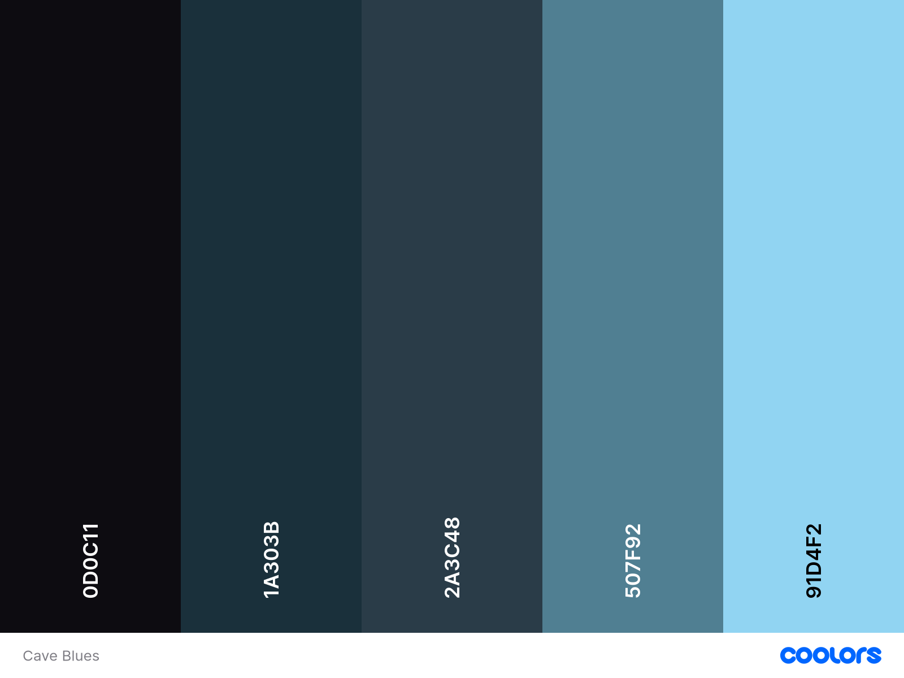
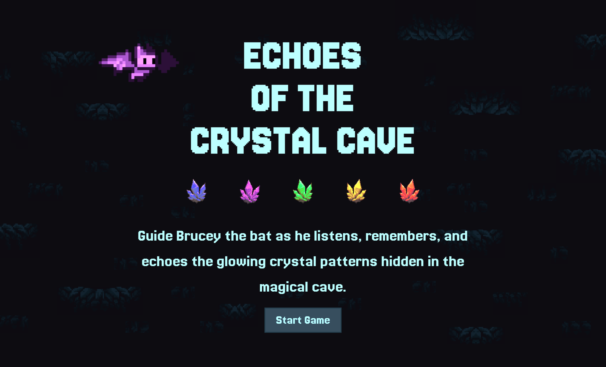
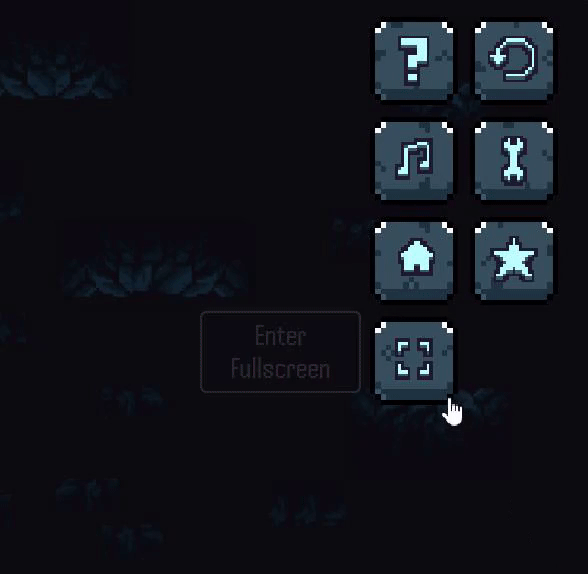
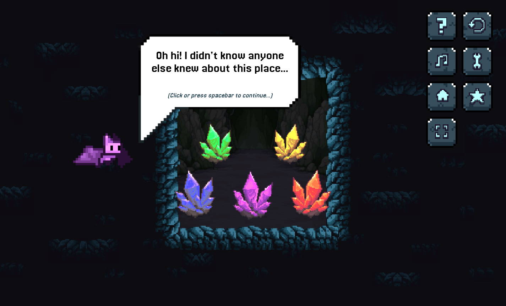
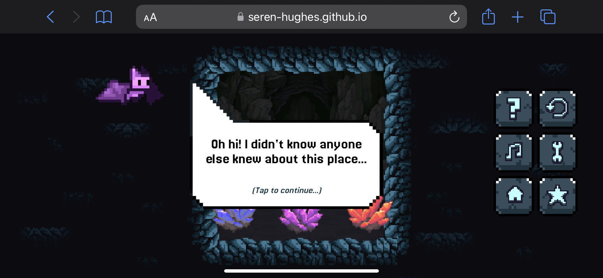

# Echoes of the Crystal Cave
#### A pixel art memory game


#### About:

A musical memory game inspired by Simon and Bop It, Echoes of the Crystal Cave gives the classic format a unique twist. Set in a mysterious cave filled with glowing crystals, the game uses a five-note musical scale and atmospheric audio to create an immersive experience. Players interact with animated, glowing crystals that light up and play tones. Designed with accessibility, responsiveness, and pixel-art charm in mind, the game is easy to play yet increasingly challenging.

[View Live Site on GitHub Pages.](https://seren-hughes.github.io/crystal-cave/) 

**_Key features that make Echoes of the Crystal Cave unique and engaging:_**

- Musical memory gameplay based on a five-note scale
- Pixel-art cave environment with atmospheric sound effects
- Glowing, animated pixel-art crystals
- Animated bat character (Brucey) guiding the player
- Responsive controls for keyboard, mouse, and touch devices
- Personalised greetings and returning player recognition
- Accessibility features including visual cues for colour vision differences
- Increasing difficulty with each level
- Freestyle mode for creative exploration of the crystal sounds
- Progress and stats saved in local storage, including best level and highest memory streak
- Game Dashboard modal for easy access to player stats and customisation settings

## Table of Contents:
- [Objectives](#objectives)
- [User Stories](#user-stories)
- [Design & Planning](#design--planning)
- [Game Mechanics](#game-mechanics)
- [Wireframes](#wireframes)
- [Pseudocode](#pseudocode)
- [Function Structure](#function-structure-and-game-pseudocode-refined)
- [Project Kanban Board](#project-kanban-board)
- [Typography](#typography)
- [Colour Palette](#colour-palette)
- [Technologies Used](#technologies-used)
- [Features](#features)
  - [Features Home Page](#features-home-page)
  - [Features Game Page](#features-game-page)
  - [Features UI Navigation](#features-ui-navigation)
  - [Features Speech Bubble Modal](#features-speech-bubble-modal)
  - [Features How to Play Modal](#features-how-to-play-modal)
  - [Features Game Dashboard Modal](#features-game-dashboard-modal)
  - [Features Audio & Sound Design](#features-audio-sound-design)
  - [Features Game Over Modal](#features-game-over-modal)
  - [Features Freestyle Mode](#features-freestyle-mode)
  - [Features Error Page](#features-error-page)
  - [Additional Features](#additional-features)
- [Deployment](#deployment)
- [JavaScript JSDoc Documentation](#javascript-jsdoc-documentation)
- [Testing](#testing)
- [Future Enhancements](#future-enhancements)
- [Credits](#credits)
- [Acknowledgements](#acknowledgements)

## Objectives:

**Target Audience:**
- Casual gamers who enjoy quick, skill-based challenges.
- All age groups, from children to adults, due to simple controls and gameplay.
- Fans of retro and pixel art games looking for a nostalgic yet fresh experience.
- Fans of music based games.
- Fans of memory games and memory training games (music memory included).

## User Stories

### Gameplay & Progress
- _As a player, I want to start a new game easily, so I can quickly begin playing._
- _As a player, I want to see my progress and highest level, so I can track and improve my performance._
- _As a player, I want visual and audio feedback for correct and incorrect actions, so I understand my progress and mistakes._
- _As a player, I want the crystals to light up and play sound when I interact with them, so I know my input was registered._

### Instructions & Accessibility
- _As a new player, I want clear, simple instructions, so I can understand the game quickly._
- _As a player, I want accessible controls (mouse, keyboard, touch), so I can play on any device._
- _As a player, I want clear icons or tooltips for each button, so I understand their purpose even without text._

### Navigation & Settings
- _As a player, I want clear, accessible buttons to restart, return home, view instructions, and access settings, so I can easily control my experience._
- _As a player, I want to toggle full-screen mode and sound, so I can play comfortably in different environments._
- _As a player, I want to delete my saved progress, so I can start fresh whenever I choose._
- _As a user, if I land on a broken or missing page, I want to see a friendly 404 message and a clear way to return to the homepage._

### Personalisation & Persistence
- _As a player, I want to enter a username and receive personalised messages, so the game feels more engaging._
- _As a returning player, I want my progress (like highest level) to be saved locally, so I can aim to improve over time._

### Audio & Immersion
- _As a player, I want to hear ambient cave sounds and background music, so the game feels immersive._
- _As a player, I want to adjust or mute the game’s audio, so I can customise the experience to suit my environment._

### Freestyle Mode (Bonus)
- _As a player, I want to play the crystal notes freely, so I can experiment with the sounds and enjoy them outside of the main game._

---

# Design & Planning

### Game Overview:
Echoes of the Crystal Cave is a memory-based puzzle game where players help Brucey the bat navigate a mysterious cave filled with glowing, musical crystals. Players must watch and listen to and repeat sequences of notes to progress, while enjoying a dynamic audio-visual experience.

### Concept:
Help Brucey the bat remember the sequence of crystals. 

### Game Mechanics:
#### Controls:
- **Mouse Click** – Click on the crystals to play their notes.
- **Touch Screen Tap** – Tap crystals on mobile for touch interaction.
- **Keyboard Keys (A, W, S, E, D)** – Alternative input for accessibility.
#### Visual & Audio Cues:
- Crystals glow in different colours when activated.
- Each crystal plays a distinct note in a five-note scale.
- Correct sequence all crystals glow and a rewarding sound plays before the next level sequence starts.
- Incorrect sequence results in modal pop up with encouraging 'try again' messages (_could have random inspiring messages_) and option to play again yes/no buttons. 

#### Win Conditions:
- Successfully repeat the full sequence to advance to the next round.

#### Lose Conditions:
- In Hard/Default Mode, a single mistake results in a game over. 
- _(could have feature)_ Easy Mode, players have three chances before restarting.

#### Could have features:
- **Easter egg** - Player name input. If name is equal to Brucey, Brucey the bat changes colour or wears a hat. 

#### Level Design & Sequence Length:
1. Level 1 = sequence of 3
2. Level 2 = sequence of 4
3. Level 3 = sequence of 5 
... and so on.


#### Reference Images:
- Music notes/scale and crystal colour correspondence layout:


#### Game inspiration: 
Brucey the plush bat - inspired the game’s theme. 


## Initial Planning & Sketches

Before creating digital wireframes, I began with rough hand-drawn notes and layout sketches to quickly capture my ideas for gameplay, UI, and features. At this stage, I also started thinking about the basic pseudocode — such as how many containers would be needed for the game layout and how the game would flow. This helped me visualise the game structure and user experience before moving on to more refined wireframes.

Below are some of my initial hand-drawn notes and layout sketches. While extremely rough, they show my early ideas and the creative planning process before moving to digital wireframes.

<details><summary>Click to view rough game container sketches.</summary>


</details>

<details><summary>Click to view rough UI sketches.</summary>


</details>

---
_These early sketches helped me clarify the game’s structure and user flow before moving on to more polished wireframes._

## Wireframes

1. ### Index / Home Page:


2. ### Instructions Modal View:


3. ### Game Page:


4. ### Landscape View Small Devices:


5. ### Greetings / Ready? Modal:


6. ### Game Page Modal View:


7. ### 404 Error Page:


## Pseudocode 

Basic pseudocode was used during the early planning and development stage. It was helpful to write out the basic logic in order to visualise the game layout and html div containers needed in order to make dynamic changes to each componant. 

### Game Initialization:

- Start the game when the player clicks "Start".
- Set the initial level to 1.
- Determine sequence length based on the level (Level 1 = 3, Level 2 = 4, Level 3 = 5 etc.).
- Generate a random sequence of numbers (1 to 5), each representing a crystal.
- Store the sequence.
- Display (play) the sequence by making the corresponding crystals glow and play their notes.

### Player Input:

- Wait for the player to start inputting their sequence by clicking on crystals.
- Store each clicked crystal in an array in the order they are clicked.
- After the player has entered the full sequence, compare it to the generated sequence.

### Sequence Validation:

- _**If the player's input matches the generated sequence:**_
  - Play a success animation (all crystals glow, twinkly music plays).
  - Increase the level.
  - Generate a new sequence with an increased length.
  - Display the new sequence.

- _**If the player's input does not match:**_

  - Display "Game Over" modal with retry option.
  - Option to restart from Level 1.

### Additional Features:

- Implement difficulty modes (e.g., limited attempts in hard mode/lives in easy mode/faster sequence speed).
- Add settings like brightness and sound control.
- Store player progress (e.g., name and highest level reached) in local storage.
- Easter egg for special player name (e.g., "Brucey" replace bat pixel sprite).

## Function Structure (and game psuedocode refined)

1. `startGame()`

    - Resets level to 1
    - Generates an initial sequence of 3 crystals
    - Displays the sequence to the player

2. `storeSequence()`

    - Generates a random sequence of crystal notes for each level
    - Ensures each level has a completely new sequence (level + 2)

3. `playSequence()`

    - Loops through the stored sequence
    - Makes each crystal glow and plays the corresponding note

4. `waitForPlayerInput()`

    - Captures player clicks, keyboard keys / A,W,S,E,D / touch, on crystals
    - Stores their input sequence

5. `checkPlayerInput()`

    - Compares player’s input with the stored sequence
    - If correct: calls `nextLevel()`
    - If incorrect: calls `showPlayAgainModal()`

6. `nextLevel()`

    - Increments level by 1
    - Calls `storeSequence()` to generate a new, longer sequence (by 1)
    - Calls `playSequence()` to show the new sequence

7. `showPlayAgainModal()`

    - Displays a modal asking if the player wants to retry
    - If "Yes": Calls `startGame()` to reset
    - If "No": Ends the game - return to home page

### Early Planning & Visualisation

To help plan and understand the logic for my project, I wrote out basic pseudocode and used [Python Tutor](https://pythontutor.com/) to visualise how my functions and arrays would work. This approach, learned during my course, made it much easier to break down the game’s mechanics and debug early logic before building the full game.

Below are some screenshots of my early function experiments in Python Tutor:

<details>
<summary>Testing the initial game start and modal logic.</summary>


</details>

<details><summary>Stepping through level progression and sequence updates.</summary>


</details>

<details><summary>Testing random sequence generation for each level.</summary>


</details>

<details><summary>Simulating how the sequence is played back to the player.</summary>


</details>

<details><summary>Visualising how player input is stored in an array.</summary>


</details>

<details><summary>Checking player input against the correct sequence and handling next level and game over logic.</summary>


</details>

--- 
_This early visualisation and step-by-step debugging helped me confidently move from pseudocode to working JavaScript code._

## Project Kanban Board

The project was managed using a Kanban board to track tasks and features. This helped me stay organised and focused on the development process. The board was regularly updated to reflect progress and priorities.

[View Echoes of the Crystal Cave Project Kanban Board](https://github.com/users/Seren-Hughes/projects/6)

## Typography

Google Fonts Selection:

For the game's typography, I aimed to capture a retro, pixel-inspired aesthetic without sacrificing readability, especially for longer text.

### **Jersey 20** Designed by Sarah Cadigan-Fried 


**Jersey 20** was selected as the primary font for its pixelated, slightly retro style, which fits the game's theme perfectly. Unlike many pixel fonts that can seem hard to read, Jersey 20 maintains excellent legibility, making it ideal for headings, speech bubble text, and body text across the game site.

### **Handjet** Designed by Rosetta, David Březina


**Handjet** was chosen as a complementary font for more selective use, such as level numbers, tooltips, and modals. Its stronger pixelated look adds character where appropriate, without overwhelming the overall readability of the UI.

This combination balances a nostalgic pixel-game feel with a user-friendly reading experience, ensuring the game remains visually thematic and accessible.

## Colour Palette

The game's colour palette was refined using Coolors to achieve the right balance of aesthetic feel and accessibility. I chose a combination of dark and muted light blues for the backgrounds, headings, and button icons.

Accessibility was a priority: contrast ratios were carefully checked during development to ensure good readability for all text and UI elements.

Speech bubbles use classic black and white for maximum clarity against the dark backdrop, maintaining a clean and focused dialogue progression. 



The crystals are designed with bright, saturated colours so they stand out vibrantly against the dark background cave design. 


**Accessibility & Visual Cues:**  
To ensure the game is playable for players with colour vision differences, the crystal glow effect was designed to provide a strong visual cue that does not rely solely on colour. During development, I tested the crystal animations using the Colorblindly Chrome extension (Monochromacy/Achromatopsia mode) and recorded a GIF to demonstrate that the glow and brightness changes remain visible even in monochrome. This means that while the crystal colours are a big feature, they are not essential for gameplay — players can rely on the glow effect as a clear indicator.


*Future plans include extending the settings modal with a filter/slider to allow players to increase the glow, contrast, or brightness of the crystals, making the game even more accessible for a wider range of visual needs.*

## Technologies Used

### Development & Deployment
- **GitHub** — Version control and project hosting
- **VSCode** — Code editing
- **GitHub Pages** — Hosting the live site

### Languages & Frameworks
- **HTML** — Semantic structure and content
- **CSS3** — Styling, responsive layouts
- **JavaScript (ES6+)** — Interactivity, game logic, DOM manipulation
- **JavaScript Modules (ES6+)** — Organising code into separate, reusable files using `import` and `export`

### Audio & Visuals
- [**Web Audio API**](https://developer.mozilla.org/en-US/docs/Web/API/Web_Audio_API) — Sound generation and crystal interaction audio
- [**Ableton Live**](https://ableton.com/) — Creating and mastering sound effects and musical notes
- [**Google Fonts**](https://fonts.google.com/) — Jersey 20 and Handjet for retro pixel-style typography
- [**Adobe Photoshop**](https://www.adobe.com/products/photoshop.html) — Editing assets, creating pixel backgrounds, modals, and sprites
- [**Tiled Map Editor**](https://www.mapeditor.org/) — Building the cave background and level layout
- [**Favicon Generator**](https://favicon.io/) — Creating a custom favicon
- [**Video to GIF Converter**](https://www.adobe.com/express/feature/video/convert/video-to-gif) - for creating GIFs for documentation

### Design & Colour
- [**Coolors**](https://coolors.co/) — Generating and refining the colour palette
- [**Eye Dropper**](https://www.eyedropper.com/) — Extracting colours from images for palette consistency

### Accessibility & Testing
- [**colorblindly**](https://colorblindly.com/) — Testing for colour accessibility and ensuring the game is playable for players with colour vision differences
- [**WebAIM Contrast Checker**](https://webaim.org/resources/contrastchecker/) — Checking colour contrast ratios
- [**Lighthouse**](https://developers.google.com/web/tools/lighthouse) — Performance and accessibility audits 

### Code Quality & Validation
- [**ESLint**](https://eslint.org/) — Used both as a VSCode extension and via the terminal for JavaScript code quality and error checking
- [**JSHint**](https://jshint.com/) — Used alongside ESLint to provide extra meticulous, stricter checks and helpful metrics feedback
- [**JSDoc**](https://jsdoc.app/) — Generating documentation from annotated JavaScript comments
- [**HTML Validator**](https://validator.w3.org/) — HTML syntax and structure checking
- [**CSS Validator**](https://jigsaw.w3.org/css-validator/) — CSS syntax and structure checking
- [**Prettier**](https://prettier.io/) — Code formatting and style consistency

### Responsive & Visual Testing
- [**Am I Responsive?**](https://ui.dev/amiresponsive) — Testing responsive design across devices
- **Chrome DevTools** — Debugging and testing
- [**Gyazo Video and GIF**](https://gyazo.com/) — Recording and sharing gameplay videos and GIFs
- [**BrowserStack**](https://www.browserstack.com/) — Cross-browser and cross-device compatibility testing

### Documentation & Planning
- **ChatGPT** — Writing aid for documentation and clarity
- [**Python Tutor**](https://pythontutor.com/) — Visualising game logic and code flow
- [**Balsamiq Wireframes**](https://balsamiq.com/wireframes/) — For creating wireframes
- **Todoist** – For managing tasks and tracking project progress.
- **Microsoft OneNote & Word** – Used to organise content, draft text, and structure ideas. 

## Features

### Features Home Page
The Home Page welcomes players with a retro pixel-art design. The page features a large title, a description of the game, and a Start Game button. The design is responsive, ensuring a consistent experience across devices.



### Features Game Page


Below is a GIF of the game page in action, showing the crystals glowing and the player playing back the correct sequence. All crystals glow when correct before the next level starts.


**Key Features of the Game Page:**
- Five interactive, glowing crystals, each with a unique sound and colour.
- Level indicator and animated bat character for guidance.
- Responsive design for desktop, tablet, and mobile.
- Accessible controls: mouse, keyboard (A, W, S, E, D), and touch.

### Features UI and Navigation

The user interface is designed for clarity and accessibility, with intuitive buttons and helpful tooltips. While all buttons are important for navigation and gameplay, three key controls—Mute/Unmute Audio, Freestyle Mode, and Fullscreen—are dynamic: they visually change to reflect their current state and update their tooltips accordingly. This provides immediate feedback and ensures players always know the current mode or setting.

- Mute and unmute audio button:

  

- Freestyle Mode Toggle:

  

- Fullscreen Toggle:

  

Other interface buttons, such as How to Play, Restart, Dashboard/Settings and Home remain visually consistent, intuitive and are also clearly labeled with tooltips for ease of use.

### Features Speech Bubble Modal

When the game page loads, the player first sees the game container, allowing them to take in the environment. After a brief pause, Brucey the bat appears with a speech bubble, introducing himself and the game. This short delay helps set the scene and gives Brucey’s introduction more impact.



In the dialogue bubble, the player is asked for their name and a name input modal opens. 


**Personalised Greeting:**  
  If the player enters a name, Brucey responds with a custom message, making the game feel more personal and engaging. The name is stored in local storage for future visits.
 


**Alternative Response:**  
  If the player skips the name input, Brucey playfully acknowledges their choice, keeping the tone light and fun.


**Returning Players:**  
  Players who return to the site and have previously entered a name are greeted with a “Welcome back” message, reinforcing a sense of continuity.


**Responsive Design:**  
  The speech bubble and name input modal are designed to be responsive, ensuring they look good on all devices. The instructions to **_'Click or press spacebar to continue'_** are on desktop. On mobile, the instructions are to tap the screen to continue. This ensures that players know how to proceed regardless of their device.

  _Mobile **'Tap to continue'** Instructions:_ 
  


### Features How to Play Modal

The How to Play modal provides players with clear instructions on how to play the game. It includes a brief overview of the game mechanics and controls. The modal is designed to be visually appealing and easy to read. 


### Features Game Dashboard/Settings Modal


The game dashboard modal provides players with a summary of their progress, including the highest level reached and best memory streak. It also offers quick access to key settings for a more personalised and accessible experience.

- **Delete Progress:**  
  Players can reset their saved progress—including their name and highest level—by clicking the "Delete Progress" button. This action reloads the page and clears all saved data. A tooltip warns players before proceeding, ensuring they are aware of the consequences.

- **Audio Settings:**  
  Players can independently adjust the volume of ambient background music, cave sound effects, and crystal notes using intuitive sliders and mute buttons. There’s also a global mute button for convenience on the main game page.

- **Brightness Control:**  
  In addition to device brightness settings, the dashboard includes a site-specific brightness slider. This allows players to increase or decrease the brightness of the game page itself, making it easier to see the crystals against the dark cave background—especially in bright environments or for those with visual needs. The effect is achieved using CSS filters and JavaScript to dynamically update the brightness level in real time.

  

### Features Audio & Sound Design

Audio is a core part of the Echoes of the Crystal Cave experience. The game features a layered soundscape with ambient cave music, interactive crystal tones, and celebratory effects.

As someone passionate about game audio, I designed Echoes of the Crystal Cave with a focus on interactive sound. The audio system is fully modular, allowing for dynamic mixing, real-time effects, and future expansion with custom music and sound design.

- **Dynamic Audio Ducking:**  
  When the crystal sequence plays or the player interacts with crystals, the ambient track automatically fades (ducks) to ensure the crystal sounds are clear and prominent. The ambient volume smoothly returns when the sequence ends, creating a polished, immersive feel.

- **Individual Track Controls:**  
  The Game Dashboard/Settings modal provides volume sliders and mute buttons for each audio channel:
  - Ambient background music
  - Cave sound effects
  - Crystal notes and celebration effects

  There’s also a global mute button for quick access on the main game page.

- **Responsive Audio Logic:**  
  All audio controls update in real time, ensuring that changes are immediately reflected in the game. This includes volume adjustments and mute/unmute actions.

*Note: The current build uses placeholder audio, but the system is ready for original, chiptune-inspired sounds and ambient music, which I plan to compose and integrate before the final release.*

**Audio User Event Permission Overlay:**  
When the game page loads, first, an overlay appears stating the site is best experienced with audio, requesting the user to click or tap to continue. A user event is a requirement for the Web Audio API to work properly. This is an effective way to ensure the user is aware of the audio and can choose to continue to enable it or not.


### Features Game Over Modal

When the player makes a mistake, a Game Over modal appears, displaying an encouraging message and options to restart or return to the home page. The modal is designed to be consistent with the game's theme.


### Features Freestyle Mode

Freestyle Mode lets players explore and play the crystal sounds without the pressure of following a sequence. Players can click or tap on the crystals to create their own melodies, experimenting with the different notes at their own pace. This mode is ideal for those who want to enjoy the musical aspect of the game or simply relax and be creative.

Looking ahead, Freestyle Mode is designed to be expandable — with plans for more complex musical features and potential integration with the Web MIDI API, allowing for even greater interactivity and creativity.

### Features Error Page

The custom 404 page matches the game's mysterious cave theme. It features fading/flickering crystals, and the message “404: Lost in the Cave. The echoes fade... you are not where you're meant to be...” A Return Home button helps guide players back if they get lost.


**Fading/Flickering Crystals:**


### Additional Features:
#### 🎨 Visual Polish and Fade-In Effects
Throughout _Echoes of the Crystal Cave_, a consistent fade-in animation is used for major elements:

- Home screen titles and images
- Game container and interface elements
- Modals, overlays, and dialogue bubbles
- Crystal buttons and level indicators

**Inspiration:**

The design choice was inspired by video games, where fade-ins create a smooth, cinematic transition between scenes.

Rather than having elements appear suddenly, the fade-in makes the game feel more cohesive and polished.


**Implementation:**

Fade-ins were applied using simple CSS transitions for broad browser compatibility and performance.

The effect maintains consistency across devices without adding unnecessary complexity or heavy scripting.


# Deployment

## Creating the Repository on GitHub (via UI)

1. Sign in to [GitHub](https://github.com/).
2. Go to the Code Institute template (if used) or your own repository.
3. Click **Use this template** and select **Create a new repository**.
4. Enter a name for your repository and click **Create repository from template**.

## Cloning and Setting Up Locally

1. Open VS Code and connect your GitHub account:
   - Click on the Accounts icon (bottom-left).
   - Sign in and authorize VS Code.
2. Open the repository in VS Code using Remote Repositories:
   - Click the Source Control tab (or press `Ctrl + Shift + G`).
   - Click **Clone Repository** and select GitHub.
   - Find and select your repository.
   - Choose a location on your machine.
   - Click **Open in VS Code** once cloning is complete.

## Manual Deployment via Terminal

For those who prefer the terminal, use the following commands:

```sh
# Initialise a Git repository (if not already initialised)
git init

# Add all files to the staging area
git add .

# Commit the changes with a descriptive message
git commit -m "Initial commit"

# Connect the local repository to GitHub (only needed if not already linked)
git remote add origin https://github.com/YOUR-USERNAME/YOUR-REPO.git

# Push the changes to the main branch
git push -u origin main
```

Whenever updates are made:

```sh
git add .
git commit -m "Update features and bug fixes"
git push
```

## Deploying to GitHub Pages

1. Go to your GitHub repository.
2. Click on the **Settings** tab.
3. Scroll down to the **Pages** section in the left sidebar.
4. Under **Branch**, select `main` (or the branch you want to deploy).
5. Click **Save**.
6. After a few moments, GitHub Pages will generate a link to your live site.

### **Branching and Merging**

To maintain a clean and organised codebase, this project adopts a branching workflow. For this project, I created a dedicated feature branch for a major refactor, which I merged into the main branch before deployment. In future development, I plan to use this workflow for all significant changes.  

1. **Creating a New Branch:**  
To create a new branch for a specific feature or module refactor:  
```bash
git checkout -b feature/branch-name
```

2. **Making and Committing Changes:**  
Make your changes, then stage and commit:  
```bash
git add .
git commit -m "Implement new feature or refactor module"
```

3. **Pushing the Branch to GitHub:**  
Push the branch to GitHub:  
```bash
git push -u origin feature/branch-name
```

4. **Merging the Branch into Main:**  
Once the feature/refactor is complete and tested, merge it into the main branch:  
- Switch to the main branch:  
  ```bash
  git checkout main
  ```
- Pull the latest changes to ensure it’s up to date:  
  ```bash
  git pull origin main
  ```
- Merge the feature branch:  
  ```bash
  git merge feature/branch-name
  ```
- Resolve any merge conflicts, then commit the changes:  
  ```bash
  git add .
  git commit -m "Merge feature/branch-name into main"
  ```

5. **Pushing the Merged Changes:**  
Push the updated main branch to GitHub:  
```bash
git push
```

- Alternatively, you can open a Pull Request on GitHub to merge your feature branch into main. This is recommended for collaboration and for keeping a clear history of code reviews and merges.

# JavaScript JSDoc Documentation
Full reference documentation for all JavaScript classes and functions in this project is auto-generated using JSDoc and the docdash template.

[View the full JavaScript JSDoc Documentation](https://seren-hughes.github.io/crystal-cave/docs/index.html)

## Updating JavaScript JSDoc Documentation

Any changes to the JavaScript code or JSDoc comments can be regenerated to the documentation using the following command in the terminal:

```sh
npx jsdoc assets/js -r -d docs -t ./node_modules/docdash
```

- `assets/js` — your JavaScript source folder
- `-r` — recursive (includes subfolders)
- `-d docs` — output folder for documentation
- `-t ./node_modules/docdash` — use the docdash template

After running this command, commit and push the updated `docs/` folder to keep the online documentation up to date.

**References:**
- [JSDoc Getting Started](https://jsdoc.app/about-getting-started.html)
- [docdash Template](https://github.com/clenemt/docdash)
- [JSDoc on npm](https://www.npmjs.com/package/jsdoc)
- [npm vs npx: (freeCodeCamp)](https://www.freecodecamp.org/news/npm-vs-npx-whats-the-difference/)

# Testing
The website has been thoroughly tested to ensure functionality, accessibility, and responsiveness across devices and browsers. All HTML, CSS, and JavaScript have passed validation checks without errors, and Lighthouse scores are excellent for performance, accessibility, best practices, and SEO.

During development, I documented key troubleshooting steps, challenging issues, and their solutions to provide transparency and aid future maintenance. Manual testing was performed for all major features, and automated JavaScript testing with Jest is planned to further ensure code reliability.

For a detailed breakdown of the testing process—including validation results, Lighthouse scores, bug fixes, troubleshooting notes — please refer to [TESTING.md](TESTING.md).

## Future Enhancements

### **Canvas API Animations**
During development, I researched the [Canvas API](https://developer.mozilla.org/en-US/docs/Web/API/Canvas_API/Tutorial) to explore more advanced bat animations and dynamic backgrounds.
Due to project scope and deadlines, full Canvas integration was deferred. However, I plan to continue studying the Canvas API to enhance future versions of the game with layered animations, scaling effects, and smoother sprite control.

### **🎛️ Web MIDI API Integration (Planned)**
To expand the interactivity of Echoes of the Crystal Cave, I plan to implement Web MIDI API functionality. This would allow players to connect a MIDI controller (such as a Novation Launchpad) to the game.

How it would work:

**Crystal Layout Mirroring:**
The crystals' colours and glow states will be reflected on the physical controller's pads.

**Example Images:**


**Hardware Input:**

- Players could tap their Launchpad buttons instead of clicking or tapping on screen or the keyboard A, W, S, E, D keys.
- The game will listen for MIDI input events and trigger the corresponding crystal animations and sounds.

**Real-Time Feedback:**
Correct inputs would trigger light animations and sounds on the hardware in sync with the game.

### **🥁 Rhythm Mode Expansion (Disco Mode)**

Alongside traditional memory gameplay, I aim to introduce an optional Rhythm Memory Mode:

- Players must match the crystal sequence and the beat of a background track.
- Audio cues and visual feedback will be precisely timed using the Web Audio API.
- Light effects (on-screen and on hardware) would pulse rhythmically to guide the player.

This would combine memory skills with timing accuracy, offering a fresh twist for players who enjoy rhythm games.

🎯 **Target Audience**
The expanded features are designed to appeal to a broad audience:

- Casual gamers who enjoy accessible memory games with a musical twist.
- Music enthusiasts, DJs, and producers who appreciate MIDI technology and rhythm challenges.
- Parents who want to introduce their children to music creation in a fun way.
- Players of all ages who enjoy games that blend creativity, sound, and visual charm.

The goal is to create an experience that is easy to pick up but rewarding to master, and that bridges the gap between gameplay and musical creativity.

### **🏆 Achievements**
I plan to implement an achievements system to reward players for reaching milestones, such as completing levels, achieving high scores, or discovering hidden features. This will encourage replayability and provide a sense of accomplishment.
The achievements could be displayed in a dedicated modal with mystery badges that unlock as players progress.
- **Example Achievements:**
  - First Echo - _Complete your first level._
  - Crystal Apprentice - _Reach level 5._
  - Brucey's Blessing - _Play the game with the name 'Brucey' for a special Easter egg._


### **Modularisation:**
- Following the successful refactor of the audio logic into a dedicated `AudioManager` module, I plan to continue modularising the codebase. This will improve maintainability, scalability, and readability as the project grows. 

### **Refactor Complex Functions for Maintainability**
- Based on feedback from JSHint metrics, I have identified that some functions — such as the main initialisation function that sets up event listeners and UI after the DOM loads — have a cyclomatic complexity value of 10, which is at the upper limit of recommended maintainability.
- I understand that this function’s complexity is due to handling many responsibilities (UI setup, event binding, game logic) in one place.
- In future development, I plan to refactor this and other complex functions (as part of ongoing modularisation) to reduce their complexity, improve readability, and make the codebase easier to understand and maintain for both myself and other developers.
- This will involve breaking down large functions into smaller, single-purpose functions and ensuring each module has a clear responsibility.

### **Improve JSDoc Comments:** 
- I intend to improve JSDoc comments throughout the codebase to provide clearer documentation and enhance the quality of the generated output using Docdash. 

### **Automated Unit & Regression Testing:**
- I recognise the value of setting up automated unit tests, especially with future refactors and new features in mind. As the codebase becomes more modular, testing will help make sure that existing functionality stays intact.

- I plan to use Jest for this, taking advantage of its built-in jsdom environment to test both core logic and DOM-related code.

- These tests will help catch bugs earlier, support future development, and act as regression tests to prevent issues when making bigger changes — like modularisation or integrating the Web MIDI API.

# **Credits**

## Art Assets:

- [Pixel Art Bat Sprite](https://caz-creates-games.itch.io/bat) _by Caz Creates Games_ - Brucey the bat sprite used in the game.
- [UI Asset Pack](https://samuel-tome.itch.io/ui-asset-pack) _by Samuel Tome_ - UI icons used in the game.
- [UI Buttons](https://totuslotus.itch.io/pixel-ui-buttons) _by Totus Lotus_ - UI buttons used in the game.
- [Pixel Art Cave Background](https://mugenencount.itch.io/pixel-cave-backgrounds-vol1) _by MugenenCount_ - Background cave design used in the game (modified).
- [Pixel Art Crystals](https://craftpix.net/freebies/top-down-crystals-pixel-art/?srsltid=AfmBOooHE0h1oaAqLnrkDlPHTrKJBthANdEfDjSjQsZhi1YWQCfKYjSy) - Crystals used in the game.
- [Pixel Cave Wall Tileset](https://ansimuz.itch.io/super-grotto-escape-pack) _by Ansimuz_- Environment tileset used in the game.
- [Speech Bubble](https://justajoke.itch.io/pixel-speech-balloons) _by Just a Joke_ - Speech bubble used in the game.

### Google Fonts:
- [Jersey 20](https://fonts.google.com/specimen/Jersey+20) _by Sarah Cadigan-Fried_ - Primary font used in the game.
- [Handjet](https://fonts.google.com/specimen/Handjet) _by Rosetta, David Březina_ - Secondary font used in the game.


## References & Online Resources

Throughout development, I consulted a wide range of online resources, tutorials, and community posts. Key references are grouped below by topic.

### JavaScript Structure & Modules
- [Should I break up a large JavaScript file? (Quora)](https://www.quora.com/Should-I-break-up-a-large-JavaScript-file-into-separate-modules-or-is-it-preferable-to-keep-it-as-one-file-Does-breaking-up-a-file-help-with-maintenance-and-debugging-in-the-first-place)
- [JavaScript Module Pattern In-Depth](https://www.nilovelez.com/blog/javascript-module-pattern-in-depth/)
- [How to use ES6 Modules to separate your JavaScript](https://www.theodinproject.com/lessons/javascript-es6-modules)
- [MDN: ES6 Modules](https://developer.mozilla.org/en-US/docs/Web/JavaScript/Guide/Modules)
- [Best practices for using and linking multiple JS files (Reddit)](https://www.reddit.com/r/learnjavascript/comments/efh8s8/best_practices_for_using_and_linking_multiple_js/)
- [Exploring globalThis in JavaScript](https://medium.com/@alperen.talaslioglu/exploring-globalthis-in-javascript-a-unified-global-object-81986042341a)
- [MDN: Property Accessors](https://javascript.info/property-accessors)
- [Singleton Pattern in JavaScript (freeCodeCamp)](https://www.freecodecamp.org/news/singleton-design-pattern-with-javascript/)
- [What is globalThis? (LogRocket)](https://blog.logrocket.com/what-is-globalthis-why-use-it/)
- [JavaScript ES6 Modules - The Odin Project](https://www.theodinproject.com/lessons/javascript-es6-modules)

### Web Audio API & Audio Implementation
- [Web Audio API: Changing the Volume of a Sound (web.dev)](https://web.dev/articles/webaudio-intro#changing_the_volume_of_a_sound)
- [Web Audio API Intro (web.dev)](https://web.dev/articles/webaudio-intro)
- [Standardized Audio Context (GitHub)](https://github.com/chrisguttandin/standardized-audio-context)
- [Web Audio API Best Practices (MDN)](https://developer.mozilla.org/en-US/docs/Web/API/Web_Audio_API/Best_practices)
- [Web Audio API Book (free)](https://webaudioapi.com/book/) _This is a fantastic free resource!_
- [Dealing with Latency (Jamie On Keys)](https://www.jamieonkeys.dev/posts/web-audio-api-output-latency/)
- [Unlock Web Audio in Safari for iOS and macOS](https://www.mattmontag.com/web/unlock-web-audio-in-safari-for-ios-and-macos)
- [Web Audio on iOS Issues (HTML5 Game Devs)](https://www.html5gamedevs.com/topic/48284-solved-webaudio-on-ios-still-no-solution-in-2022/)
- [Webkit AudioContext Code](https://github.com/WebKit/WebKit/blob/cbf93f016e9697a706929e9b8bdc7a243041e0f8/Source/WebCore/Modules/webaudio/AudioContext.idl#L38-L39)

### CSS Effects & Animations
- [CSS Glow Effect for Images (Stack Overflow)](https://stackoverflow.com/questions/8693733/how-to-give-outer-glow-to-an-object-in-a-transparent-png-using-css3)
- [CSS Fade-In Animation (HubSpot)](https://blog.hubspot.com/website/css-fade-in)
- [Flickering Neon Sign Effect (CodePen)](https://codepen.io/patrickhill/pen/eYNbdQ)
- [Flickering Lamp Effect (CodePen)](https://codepen.io/prathameshkoshti/pen/PVVRMG)

### Modals & Overlays
- [Vanilla Modal Example (CodePen)](https://codepen.io/metinsaylan/pen/WgLEOx)
- [Modal Popup Example (CodexWorld)](https://www.codexworld.com/simple-modal-popup-javascript-css/)
- [CSS Tricks: Styling Modals](https://css-tricks.com/considerations-styling-modal/)
- [FreeCodeCamp: How to Build a Modal with JavaScript](https://www.freecodecamp.org/news/how-to-build-a-modal-with-javascript/)

### Documentation & JSDoc
- [JSDoc Official Site](https://jsdoc.app/)
- [JSDoc: The Ultimate Guide](https://precodes.hashnode.dev/jsdoc-the-ultimate-guide-to-documenting-your-javascript-code)
- [Document Your JavaScript Code with JSDoc (dev.to)](https://dev.to/paulasantamaria/document-your-javascript-code-with-jsdoc-2fbf)
- [Write Better, Faster, and Self-Documenting Tag Management (JSDoc)](https://thebounce.io/write-better-faster-and-self-documenting-tag-management-javascript-with-jsdoc-9a4ce1f36239)
- [Creating Better JSDoc Documentation](https://medium.com/swlh/creating-better-jsdoc-documentation-8b7a65744dcb) 
- [docdash Template](https://github.com/clenemt/docdash)

### Accessibility & Colour
- [How to Make Colors in Games Accessible (IndieKlem)](https://indieklem.substack.com/p/how-to-make-colors-games-accessible)

## Acknowledgements
- **Code Institute** — For providing a supportive course and community that enabled me to build this project.
- **Code Institute course content** — The course materials, especially the Python Tutor lessons and the "Love Maths" project, were invaluable for understanding core programming concepts and structuring my own project.
 - **Code Institute Slack Community** — An invaluable resource for advice, encouragement, and troubleshooting throughout the project.
- **Marko Tot** — Code Institute facilitator, for hosting weekly stand-up calls and sharing practical resources and guidance — especially around focusing on MVP features, meeting project deadlines, and giving constructive feedback.
- **Wallace Green** — Fellow student, for generous feedback, sharing helpful books and websites, and supporting my project’s development.
- **Dan Hamilton** — My mentor, for his encouragement and expert advice on coding best practices and audio implementation (particularly on iOS), and for sharing insights into industry standards.
- **My brother** — For insightful discussions on JavaScript architecture and file organisation, and for sharing his professional experience as a software developer.

Thank you all for your support, expertise, and encouragement!

