# Development Troubleshooting


During development, I encountered several issues with layout positioning and game logic errors. Below are the problems I faced and the solutions implemented.

## 🔎 Bat Sprite and Level Number Positioning 🛠️

### Issue:
- The bat sprite was too close to the crystal container on smaller screens and required many adjustments.
- The level number was positioned awkwardly on smaller screens, requiring too many adjustments.

### Cause: 
While media queries were functional, they lacked efficiency, leading to unnecessary repositioning at different breakpoints.

### Solution:
- Implemented a responsive wrapper for the bat sprite and level number, allowing them to scale and adjust dynamically based on screen size.
- Optimised media queries by reducing redundancy and focusing on key breakpoints.

### Testing Results:
Below is a screenshot of the DevTools Flexbox grid showing the updated layout/wrapper adjustments:

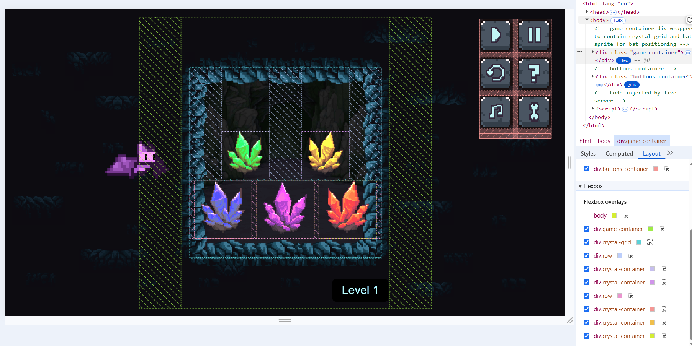


## 🔎 Uncaught ReferenceError: sequence is not defined 🛠️

### Issue:
During testing, an error appeared in the console:

```Uncaught ReferenceError: sequence is not defined at HTMLDivElement.handleCrystalClick.```

### Cause:
The issue was caused by using the target property in the handleCrystalClick function. The target property refers to the element that triggered the event, which could be a child element of the crystal container. This caused the function to fail when trying to access properties or methods on the wrong element, leading to the 'sequence is not defined' error.

### Solution:
The fix involved switching from target to currentTarget. The currentTarget property always refers to the element to which the event listener is attached, ensuring that the correct crystal container is targeted.

**Code Before Fix:**

`let clickedColor = event.target.dataset.color; // Incorrect: target could refer to a child element`

**Code After Fix:**

`let clickedColor = event.currentTarget.dataset.color; // Correct: currentTarget refers to the crystal container`

### Reasoning Behind the Fix:
Using currentTarget ensures that the handleCrystalClick function always interacts with the correct crystal container, regardless of which child element triggered the event. This resolved the sequence is not defined error and allowed the game logic to proceed as expected.

### Testing Results:
After implementing the fix, the error no longer appeared in the console. The game correctly identified the clicked crystal and updated the player's input sequence. Screenshots of the console logs before and after the fix are included below:

**Before Fix:**

Before Fix Screenshot

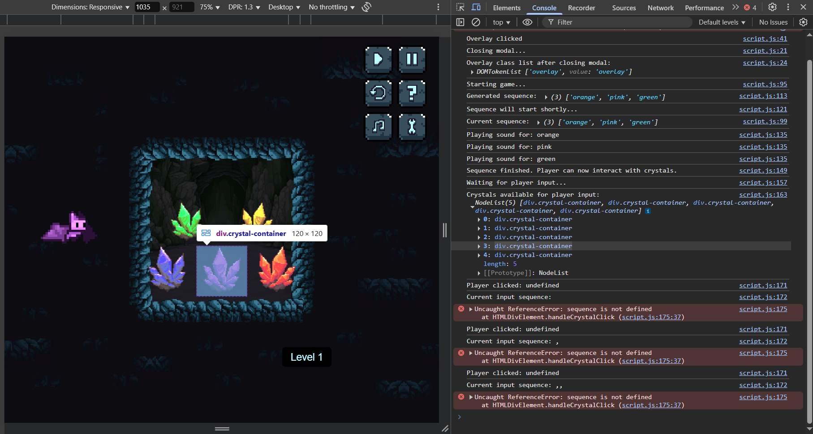

**After Fix:**

After Fix Screenshot:

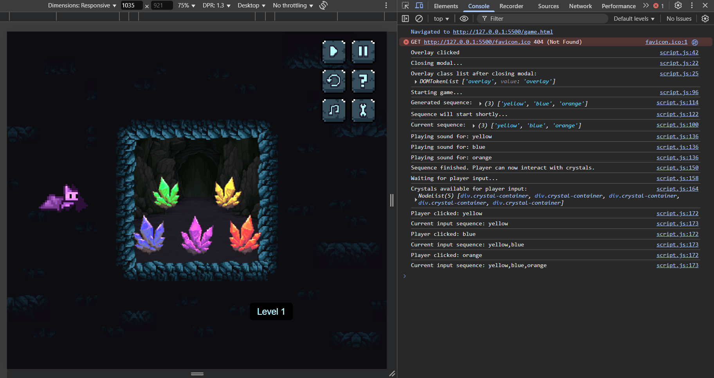

## 🔎 Duplicate Event Listeners on Player Clicks 🛠️

### Issue: 

During testing, I noticed that clicking on a crystal was registering multiple times in the console. For example, a single click on a crystal would log the `Player clicked:` message three times. This caused the game logic to behave incorrectly, as it treated one click as multiple inputs.

### Cause: 

The issue was caused by event listeners being added multiple times to the same crystal elements. Each time the `waitForPlayerInput` function was called, it added new `click` event listeners to the crystals without removing the existing ones. This resulted in duplicate (or even triplicate) event listeners being attached to the same crystal.

### Solution: 

The fix involved removing any existing event listeners before adding new ones. This was achieved by calling `removeEventListener` for each crystal before attaching the `click` event listener again. This ensured that only one event listener was active for each crystal at any given time.

**Code Before Fix:** 

```js
crystals.forEach(crystal => {
    crystal.addEventListener("click", handleCrystalClick); // Adds a new listener without removing existing ones
    console.log("Adding event listener to:", crystal.dataset.color); // Debugging message
}); 
``` 
**Code After Fix:** 

```js 
crystals.forEach(crystal => {
    crystal.removeEventListener("click", handleCrystalClick); // Remove previous listeners
    crystal.addEventListener("click", handleCrystalClick); // Add new one
    console.log("Adding event listener to:", crystal.dataset.color); // Debugging message
});
```
### Reasoning Behind the Fix:
By removing existing event listeners before adding new ones, the game ensures that each crystal has only one active event listener. This prevents duplicate clicks from being registered and resolves the issue of multiple logs for a single click.

### Testing Results:
After implementing the fix, each click on a crystal was logged only once in the console. The game logic correctly processed each click as a single input.

**Before Fix:**

Before Fix Screenshot

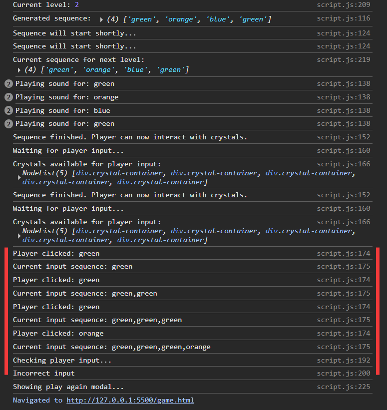

**After Fix:

After Fix Screenshot

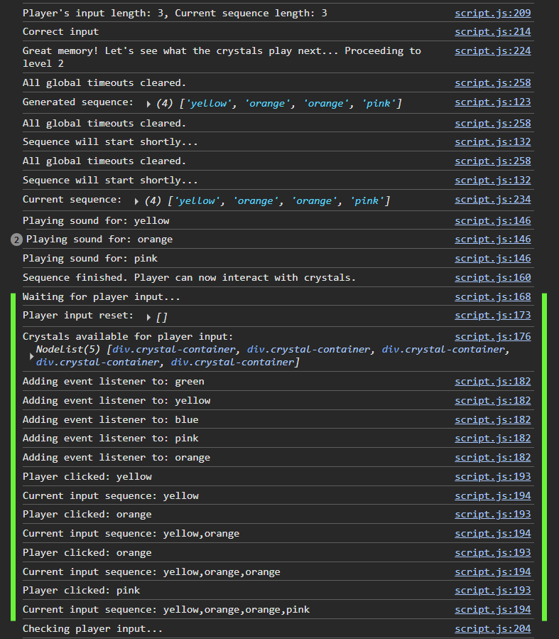


## 🔎 Lingering Glowing Crystal and Last Crystal Not Glowing 🛠️

### Issue: 

During testing, I encountered two related issues:

1. The last crystal clicked by the player in the sequence would remain glowing after the sequence was completed.
2. After fixing the lingering glow issue, the last crystal clicked in the sequence stopped glowing entirely, even though it was being logged correctly and matched the sequence length.

### Cause: 

1. The lingering glow issue was caused by the glow effect not being cleared properly for the last clicked crystal. This was likely due to overlapping or incomplete timeout logic.
2. The issue of the last crystal not glowing was caused by the `checkPlayerInput` function being called immediately after the last click, interrupting the glow deactivation logic.

### Solution:

To address these issues:

1. I ensured that all glow effects were cleared at appropriate times using the `clearAllGlows` function.
2. I introduced a short delay (600ms) before calling `checkPlayerInput` to allow the glow deactivation logic for the last clicked crystal to complete.

**Code To Fix Lingering Glow:**

```js
function clearAllGlows() {
    let crystals = document.querySelectorAll(".crystal-container");
    crystals.forEach(crystal => {
        crystal.querySelector('.glow').classList.remove('active');
        crystal.querySelector('.light-crystal').classList.remove('active');
    });
    console.log("All glow effects cleared."); // Debugging message
}
```

**Code After Complete Fix (Delay for Last Crystal Glow):**

```js
if (playersInput.length === currentSequence.length) {
    isPlayerTurn = false; // Prevent further input
    console.log("Player input complete. Checking input after delay...");

    // Delay input validation to allow glow deactivation
    setTimeout(() => {
        checkPlayerInput(); // Compare with the correct sequence
    }, 600); // Match the glow deactivation duration
}
```

### Reasoning Behind the Fix:

- Clearing all glow effects ensures that no crystals remain glowing after the sequence finishes.
- Adding a delay before `checkPlayerInput` allows the glow deactivation logic for the last clicked crystal to complete, ensuring that it glows properly before transitioning to the next step.

### Importance of Console Messages:

The console messages were instrumental in troubleshooting this issue. By carefully analyzing the sequence of logs, I was able to pinpoint where the logic was being interrupted. The key success message, `"Player input complete. Checking input after delay"`, confirmed that the delay allowed the glow deactivation to complete before transitioning to input validation.

### Testing Results:

1. No crystals remained glowing after the sequence finished.
2. The last crystal clicked glowed properly and deactivated before transitioning to input validation.

### Console Log After Fix:

Below is a screenshot of the console log showing the success message `"Player input complete. Checking input after delay"`, confirming that the issue was resolved:

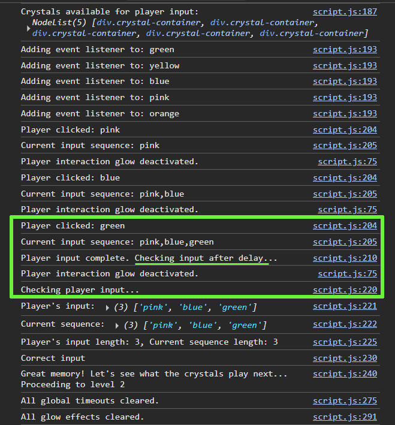

## 🔎 Mobile Touch Events Not Working 🛠️

### Issue: 

During testing on mobile devices, the game stopped progressing after the first sequence. While the crystals glowed and played back correctly, the game did not respond to player clicks or touches. Interestingly, the game worked perfectly in desktop browsers and in mobile emulation mode in DevTools.

### Cause: 

The issue was caused by missing or conflicting event listeners for touch events (`touchstart` or `touchend`) on mobile devices. While `click` events worked on desktop, mobile devices rely on touch events, and the existing logic did not properly handle these events. Additionally, duplicate event listeners were being added, which may have caused unexpected behavior.

### Solution:

The fix involved ensuring that both `click` and `touchend` event listeners were properly managed for each crystal. Specifically:

1. **Remove Existing Event Listeners:** Before adding new event listeners, any previously attached listeners were removed using `removeEventListener`.
2. **Add Both `click` and `touchend` Listeners:** Both event types were added to ensure compatibility across desktop and mobile devices.

**Code Before Fix:**

```js
crystals.forEach(crystal => {
    crystal.addEventListener("click", handleCrystalClick); // Only adds click event listener
    console.log("Adding event listener to:", crystal.dataset.color); // Debugging message
});
```

**Code After Fix:**

```js
crystals.forEach(crystal => {
    crystal.removeEventListener("click", handleCrystalClick); // Remove previous click listeners
    crystal.removeEventListener("touchend", handleCrystalClick); // Remove previous touchend listeners
    crystal.addEventListener("click", handleCrystalClick); // Add click event listener
    crystal.addEventListener("touchend", handleCrystalClick); // Add touch event listener
    console.log("Adding event listener to:", crystal.dataset.color); // Debugging message
});
```
### Reasoning Behind the Fix:

- Clearing all glow effects ensures that no crystals remain glowing after the sequence finishes.
- Adding a delay before `checkPlayerInput` allows the glow deactivation logic for the last clicked crystal to complete, ensuring that it glows properly before transitioning to the next step.

### Testing Results:

After implementing the fix: 

1. The game worked on both desktop and mobile devices
2. Crystals responded correctly to both clicks and touches


## 🔎 openModal Not Defined 🛠️

### Issue:

During testing, the "Game Over" modal failed to appear, and the following error was logged in the console:

```Uncaught ReferenceError: openModal is not defined```

### Cause:

The `openModal` function was defined inside the `DOMContentLoaded` event listener, making it inaccessible globally. As a result, other functions like `showPlayAgainModal` could not call it.

### Solution:

The `openModal` function was moved outside the `DOMContentLoaded` event listener to the global scope, ensuring it could be accessed by other functions. 

**Code Before Fix:**

```js
document.addEventListener("DOMContentLoaded", function () {
    function openModal(type, title = "", text = "", buttons = []) {
        // Modal logic here
    }
});
```
**Code After Fix:**

```js
function openModal(type, title = "", text = "", buttons = []) {
    // Modal logic here
}
document.addEventListener("DOMContentLoaded", function () {
    // Call openModal here
});
```

### Testing Results:

After moving the `openModal` function to the global scope:

1. The "Game Over" modal appeared as expected.
2. The error `openModal is not defined` no longer appeared in the console.

**Before Fix Screenshot:** 

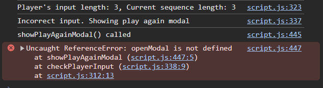

**After Fix Screenshot:** 

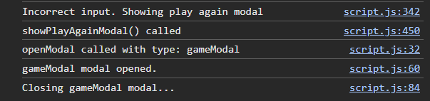

## 🔎 Overlay Blocking Modal Buttons 🛠️

### Issue:

The "Game Over" modal appeared, but the buttons inside the modal were not clickable. Using the browser's DevTools, it was discovered that the overlay was active and blocking interactions with the modal buttons.

### Cause:

The `.overlay` element had a `z-index` higher than or equal to the `.modal-container`, causing it to intercept clicks intended for the modal buttons.

### Solution:

The `z-index` of the `.modal-container` was increased to ensure it appeared above the `.overlay`. This allowed the modal buttons to be clickable and interactable.

### Testing Results:

After increasing the `z-index` of the `.modal-container`:

1. The modal buttons became clickable.
2. The button click events triggered the expected actions (e.g., restarting the game or redirecting to the home page).

DevTools Inspect Tool Screenshot Before Fix: 

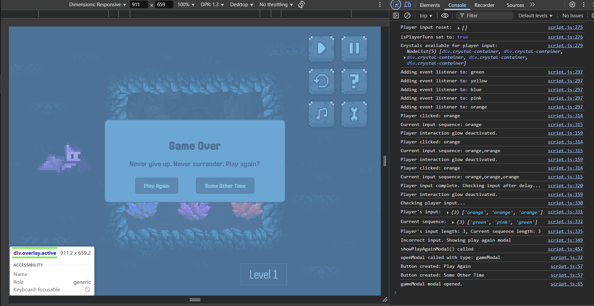

DevTools Inspect Tool Screenshot After Fix:
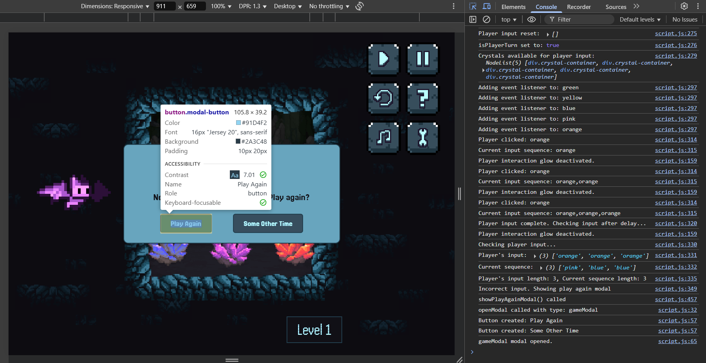

## 🔎 Overlay Not Progressing Dialogue Messages 🛠️

### Issue:

The speech bubble dialogue system was not working as expected. After implementing the overlay and Brucey's dialogue messages, clicking on the overlay either wasn't progressing through the messages or was skipping directly to starting the game after a single click instead of stepping through each message.

### Cause:

The issue was caused by incorrect event handling in the overlay click listener. The overlay was active (with the .active class correctly applied), but the click events were not properly triggering the dialogue progression function. Additionally, there was confusion between the closeModal function and dialogue progression logic, causing immediate game start rather than sequential dialogue display.

### Solution:

The solution involved:

1. Creating a dedicated `progressDialogue()` function to handle dialogue advancement
2. Modifying the overlay click handler to call `progressDialogue()` instead of `closeModal()`
3. Ensuring the speech bubble remained visible until all messages were displayed
4. Only deactivating the overlay and starting the game after the final message

***Code Before Fix:**

```js
overlay.addEventListener("click", function(event) {
    closeModal("speechBubble", event); // Immediately closes the speech bubble
});
```

**Code After Fix:**

```js
overlay.addEventListener("click", function(event) {
    // If clicking a button in a game modal, ignore
    if (event.target.closest(".modal-button")) {
        console.log("Button clicked, ignoring overlay click.");
        return;
    }

    const speechBubble = document.querySelector(".speech-bubble");
    const gameModal = document.querySelector(".modal-container");

    if (!speechBubble.classList.contains("hidden")) {
        progressDialogue(); // Progress to the next message instead of closing
    } 
    else if (!gameModal.classList.contains("hidden")) {
        closeModal("gameModal", event);
    }
});

function progressDialogue() {
    console.log("Progressing dialogue. Current index:", currentMessageIndex);
    currentMessageIndex++;

    if (currentMessageIndex < speechBubbleMessages.length) {
        // Update the speech bubble with the next message
        updateSpeechBubbleText();
    } else {
        // start the game!
        const speechBubble = document.querySelector(".speech-bubble");
        const overlay = document.querySelector(".overlay");
        
        speechBubble.classList.add("hidden");
        overlay.classList.remove("active");
        console.log("Starting game after last message");
        startGame();
    }
}
```

### Testing Results:
After implementing the fix:

1. Clicking on the overlay properly progressed through each dialogue message
2. The instructions text properly updated between messages
3. After the final message, the speech bubble disappeared and the game started as expected


**Console Log Showing Proper Dialogue Progression:**

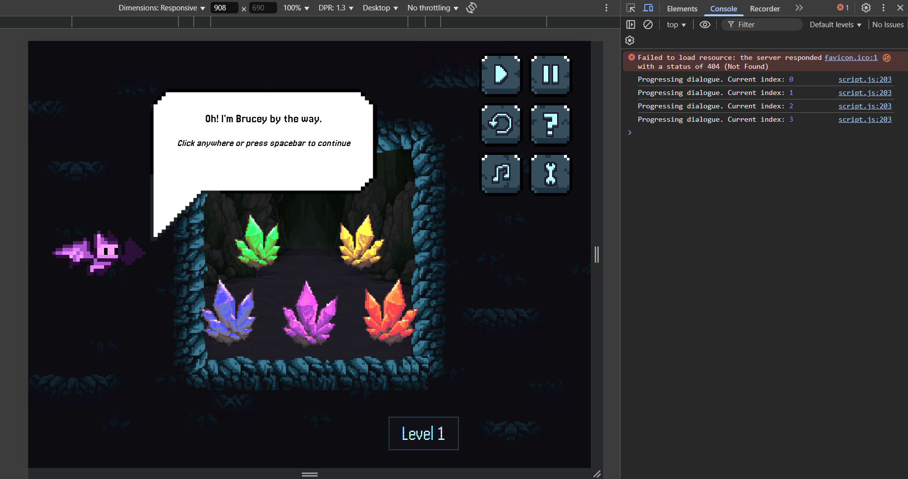

