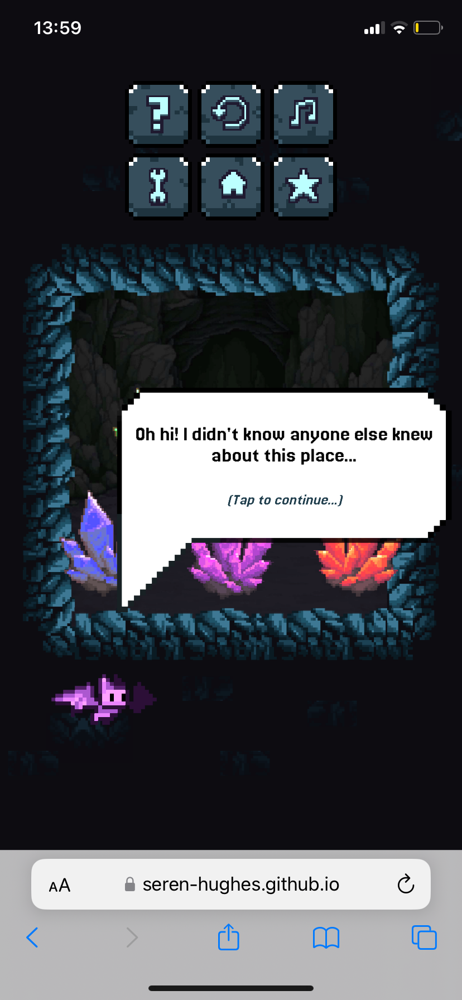
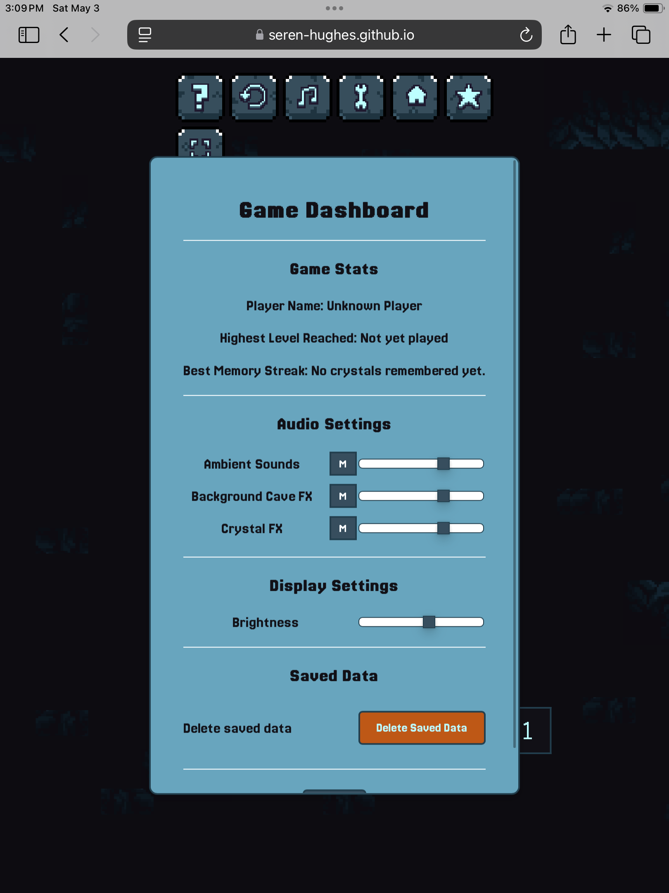

# Echoes of the Crystal Cave - Testing

## Table of Contents
- [Development & Troubleshooting](#development--troubleshooting) 
- [Lighthouse](#lighthouse)
- [Code Validation](#code-validation)
- [Responsiveness](#responsiveness)
- [Manual Testing](#manual-testing)
- [Jest Testing](#jest-testing)
- [Bugs](#bugs)
- [Future Improvements](#future-improvements)
- [Conclusion](#conclusion)  

# Development & Troubleshooting

This section documents the particularly tricky fixes and refactors encountered during active development.  
These notes were taken while building the project, and focus on real-time troubleshooting rather than post-development bug fixing.  
Later sections of this document cover post-development testing and any additional issues discovered.

<details>
<summary>🔗 Quick Navigation to Development & Troubleshooting Entries</summary>

- [Bat Sprite and Level Number Positioning](#bat-sprite-and-level-number-positioning)
- [Uncaught ReferenceError: sequence is not defined](#uncaught-referenceerror-sequence-is-not-defined)
- [Duplicate Event Listeners on Player Clicks](#duplicate-event-listeners-on-player-clicks)
- [Lingering Glowing Crystal and Last Crystal Not Glowing](#lingering-glowing-crystal-and-last-crystal-not-glowing)
- [Mobile Touch Events Not Working](#mobile-touch-events-not-working)
- [openModal Not Defined](#openmodal-not-defined)
- [Overlay Blocking Modal Buttons](#overlay-blocking-modal-buttons)
- [Overlay Not Progressing Dialogue Messages](#overlay-not-progressing-dialogue-messages)
- [Layout Discrepancies Between DevTools and iPhone](#layout-discrepancies-between-devtools-and-iphone)
- [Button Image Lag & Transition to Sprite Sheet](#button-image-lag--transition-to-sprite-sheet)
- [Level Indicator Reset Issue & Fix Attempts](#level-indicator-reset-issue--fix-attempts)
- [Overlay & Crystal Interactivity Debugging](#overlay--crystal-interactivity-debugging)
- [Mobile Browser Address Bar & Body Height Issues](#mobile-browser-address-bar--body-height-issues)
- [iOS Audio Overlay & Early Game Container Display](#ios-audio-overlay--early-game-container-display)
- [Audio Context Resume & Universal Audio User Event Overlay](#audio-context-resume--universal-audio-user-event-overlay)
- [Crystal Sounds Ignoring Mute & Ambient Volume Ducking Issues](#crystal-sounds-ignoring-mute--ambient-volume-ducking-issues)
- [JSDoc Adoption & Documentation Refactor](#jsdoc-adoption--documentation-refactor)
- [DOMContentLoaded & Initialisation Issues](#domcontentloaded--initialisation-issues)
- [Flash of Unstyled Content (FOUC)](#flash-of-unstyled-content-fouc)
- [Modal Scroll Position Not Reset](#modal-scroll-position-not-reset)
- [Settings Modal State Not Restored](#settings-modal-state-not-restored)
- [Brightness Slider, Regex Rabbit Holes & Future-Proofing Filter Controls](#brightness-slider-regex-rabbit-holes--future-proofing-filter-controls)
- [UI Mute Functionality: Syncing Global and Per-Channel States](#ui-mute-functionality-syncing-global-and-per-channel-states)
- [Modularisation & AudioManager Refactor](#modularisation--audiomanager-refactor)

</details>

---

## Bat Sprite and Level Number Positioning

### Issue:
- The bat sprite was too close to the crystal container on smaller screens and required many adjustments.
- The level number was positioned awkwardly on smaller screens, requiring too many adjustments.

### Cause: 
While media queries were functional, they lacked efficiency, leading to unnecessary repositioning at different breakpoints.

### Solution:
- Implemented a responsive wrapper for the bat sprite and level number, allowing them to scale and adjust dynamically based on screen size.
- Optimised media queries by reducing redundancy and focusing on key breakpoints.

### Testing Results:
Below is a screenshot of the DevTools Flexbox grid showing the updated layout/wrapper adjustments:


## Uncaught ReferenceError: sequence is not defined

### Issue:
During testing, an error appeared in the console:

```Uncaught ReferenceError: sequence is not defined at HTMLDivElement.handleCrystalClick.```

### Cause:
The issue was caused by using the target property in the handleCrystalClick function. The target property refers to the element that triggered the event, which could be a child element of the crystal container. This caused the function to fail when trying to access properties or methods on the wrong element, leading to the 'sequence is not defined' error.

### Solution:
The fix involved switching from target to currentTarget. The currentTarget property always refers to the element to which the event listener is attached, ensuring that the correct crystal container is targeted.

**Code Before Fix:**

`let clickedColor = event.target.dataset.color; // Incorrect: target could refer to a child element`

**Code After Fix:**

`let clickedColor = event.currentTarget.dataset.color; // Correct: currentTarget refers to the crystal container`

### Reasoning Behind the Fix:
Using currentTarget ensures that the handleCrystalClick function always interacts with the correct crystal container, regardless of which child element triggered the event. This resolved the sequence is not defined error and allowed the game logic to proceed as expected.

### Testing Results:
After implementing the fix, the error no longer appeared in the console. The game correctly identified the clicked crystal and updated the player's input sequence. Screenshots of the console logs before and after the fix are included below:

**Before Fix:**

Before Fix Screenshot


**After Fix:**

After Fix Screenshot:


## Duplicate Event Listeners on Player Clicks

### Issue: 

During testing, I noticed that clicking on a crystal was registering multiple times in the console. For example, a single click on a crystal would log the `Player clicked:` message three times. This caused the game logic to behave incorrectly, as it treated one click as multiple inputs.

### Cause: 

The issue was caused by event listeners being added multiple times to the same crystal elements. Each time the `waitForPlayerInput` function was called, it added new `click` event listeners to the crystals without removing the existing ones. This resulted in duplicate (or even triplicate) event listeners being attached to the same crystal.

### Solution: 

The fix involved removing any existing event listeners before adding new ones. This was achieved by calling `removeEventListener` for each crystal before attaching the `click` event listener again. This ensured that only one event listener was active for each crystal at any given time.

**Code Before Fix:** 

```js
crystals.forEach(crystal => {
    crystal.addEventListener("click", handleCrystalClick); // Adds a new listener without removing existing ones
    console.log("Adding event listener to:", crystal.dataset.color); // Debugging message
}); 
``` 
**Code After Fix:** 

```js 
crystals.forEach(crystal => {
    crystal.removeEventListener("click", handleCrystalClick); // Remove previous listeners
    crystal.addEventListener("click", handleCrystalClick); // Add new one
    console.log("Adding event listener to:", crystal.dataset.color); // Debugging message
});
```
### Reasoning Behind the Fix:
By removing existing event listeners before adding new ones, the game ensures that each crystal has only one active event listener. This prevents duplicate clicks from being registered and resolves the issue of multiple logs for a single click.

### Testing Results:
After implementing the fix, each click on a crystal was logged only once in the console. The game logic correctly processed each click as a single input.

**Before Fix:**

Before Fix Screenshot


**After Fix:

After Fix Screenshot


## Lingering Glowing Crystal and Last Crystal Not Glowing

### Issue: 

During testing, I encountered two related issues:

1. The last crystal clicked by the player in the sequence would remain glowing after the sequence was completed.
2. After fixing the lingering glow issue, the last crystal clicked in the sequence stopped glowing entirely, even though it was being logged correctly and matched the sequence length.

### Cause: 

1. The lingering glow issue was caused by the glow effect not being cleared properly for the last clicked crystal. This was likely due to overlapping or incomplete timeout logic.
2. The issue of the last crystal not glowing was caused by the `checkPlayerInput` function being called immediately after the last click, interrupting the glow deactivation logic.

### Solution:

To address these issues:

1. I ensured that all glow effects were cleared at appropriate times using the `clearAllGlows` function.
2. I introduced a short delay (600ms) before calling `checkPlayerInput` to allow the glow deactivation logic for the last clicked crystal to complete.

**Code To Fix Lingering Glow:**

```js
function clearAllGlows() {
    let crystals = document.querySelectorAll(".crystal-container");
    crystals.forEach(crystal => {
        crystal.querySelector('.glow').classList.remove('active');
        crystal.querySelector('.light-crystal').classList.remove('active');
    });
    console.log("All glow effects cleared."); // Debugging message
}
```

**Code After Complete Fix (Delay for Last Crystal Glow):**

```js
if (playersInput.length === currentSequence.length) {
    isPlayerTurn = false; // Prevent further input
    console.log("Player input complete. Checking input after delay...");

    // Delay input validation to allow glow deactivation
    setTimeout(() => {
        checkPlayerInput(); // Compare with the correct sequence
    }, 600); // Match the glow deactivation duration
}
```

### Reasoning Behind the Fix:

- Clearing all glow effects ensures that no crystals remain glowing after the sequence finishes.
- Adding a delay before `checkPlayerInput` allows the glow deactivation logic for the last clicked crystal to complete, ensuring that it glows properly before transitioning to the next step.

### Importance of Console Messages:

The console messages were instrumental in troubleshooting this issue. By carefully analyzing the sequence of logs, I was able to pinpoint where the logic was being interrupted. The key success message, `"Player input complete. Checking input after delay"`, confirmed that the delay allowed the glow deactivation to complete before transitioning to input validation.

### Testing Results:

1. No crystals remained glowing after the sequence finished.
2. The last crystal clicked glowed properly and deactivated before transitioning to input validation.

### Console Log After Fix:

Below is a screenshot of the console log showing the success message `"Player input complete. Checking input after delay"`, confirming that the issue was resolved:


## Mobile Touch Events Not Working

### Issue: 

During testing on mobile devices, the game stopped progressing after the first sequence. While the crystals glowed and played back correctly, the game did not respond to player clicks or touches. Interestingly, the game worked perfectly in desktop browsers and in mobile emulation mode in DevTools.

### Cause: 

The issue was caused by missing or conflicting event listeners for touch events (`touchstart` or `touchend`) on mobile devices. While `click` events worked on desktop, mobile devices rely on touch events, and the existing logic did not properly handle these events. Additionally, duplicate event listeners were being added, which may have caused unexpected behavior.

### Solution:

The fix involved ensuring that both `click` and `touchend` event listeners were properly managed for each crystal. Specifically:

1. **Remove Existing Event Listeners:** Before adding new event listeners, any previously attached listeners were removed using `removeEventListener`.
2. **Add Both `click` and `touchend` Listeners:** Both event types were added to ensure compatibility across desktop and mobile devices.

**Code Before Fix:**

```js
crystals.forEach(crystal => {
    crystal.addEventListener("click", handleCrystalClick); // Only adds click event listener
    console.log("Adding event listener to:", crystal.dataset.color); // Debugging message
});
```

**Code After Fix:**

```js
crystals.forEach(crystal => {
    crystal.removeEventListener("click", handleCrystalClick); // Remove previous click listeners
    crystal.removeEventListener("touchend", handleCrystalClick); // Remove previous touchend listeners
    crystal.addEventListener("click", handleCrystalClick); // Add click event listener
    crystal.addEventListener("touchend", handleCrystalClick); // Add touch event listener
    console.log("Adding event listener to:", crystal.dataset.color); // Debugging message
});
```
### Reasoning Behind the Fix:

- Clearing all glow effects ensures that no crystals remain glowing after the sequence finishes.
- Adding a delay before `checkPlayerInput` allows the glow deactivation logic for the last clicked crystal to complete, ensuring that it glows properly before transitioning to the next step.

### Testing Results:

After implementing the fix: 

1. The game worked on both desktop and mobile devices
2. Crystals responded correctly to both clicks and touches


## openModal Not Defined

### Issue:

During testing, the "Game Over" modal failed to appear, and the following error was logged in the console:

```Uncaught ReferenceError: openModal is not defined```

### Cause:

The `openModal` function was defined inside the `DOMContentLoaded` event listener, making it inaccessible globally. As a result, other functions like `showPlayAgainModal` could not call it.

### Solution:

The `openModal` function was moved outside the `DOMContentLoaded` event listener to the global scope, ensuring it could be accessed by other functions. 

**Code Before Fix:**

```js
document.addEventListener("DOMContentLoaded", function () {
    function openModal(type, title = "", text = "", buttons = []) {
        // Modal logic here
    }
});
```
**Code After Fix:**

```js
function openModal(type, title = "", text = "", buttons = []) {
    // Modal logic here
}
document.addEventListener("DOMContentLoaded", function () {
    // Call openModal here
});
```

### Testing Results:

After moving the `openModal` function to the global scope:

1. The "Game Over" modal appeared as expected.
2. The error `openModal is not defined` no longer appeared in the console.

**Before Fix Screenshot:** 


**After Fix Screenshot:** 


## Overlay Blocking Modal Buttons

### Issue:

The "Game Over" modal appeared, but the buttons inside the modal were not clickable. Using the browser's DevTools, it was discovered that the overlay was active and blocking interactions with the modal buttons.

### Cause:

The `.overlay` element had a `z-index` higher than or equal to the `.modal-container`, causing it to intercept clicks intended for the modal buttons.

### Solution:

The `z-index` of the `.modal-container` was increased to ensure it appeared above the `.overlay`. This allowed the modal buttons to be clickable and interactable.

### Testing Results:

After increasing the `z-index` of the `.modal-container`:

1. The modal buttons became clickable.
2. The button click events triggered the expected actions (e.g., restarting the game or redirecting to the home page).

DevTools Inspect Tool Screenshot Before Fix: 


DevTools Inspect Tool Screenshot After Fix:


## Overlay Not Progressing Dialogue Messages

### Issue:

The speech bubble dialogue system was not working as expected. After implementing the overlay and Brucey's dialogue messages, clicking on the overlay either wasn't progressing through the messages or was skipping directly to starting the game after a single click instead of stepping through each message.

### Cause:

The issue was caused by incorrect event handling in the overlay click listener. The overlay was active (with the .active class correctly applied), but the click events were not properly triggering the dialogue progression function. Additionally, there was confusion between the closeModal function and dialogue progression logic, causing immediate game start rather than sequential dialogue display.

### Solution:

The solution involved:

1. Creating a dedicated `progressDialogue()` function to handle dialogue advancement
2. Modifying the overlay click handler to call `progressDialogue()` instead of `closeModal()`
3. Ensuring the speech bubble remained visible until all messages were displayed
4. Only deactivating the overlay and starting the game after the final message

***Code Before Fix:**

```js
overlay.addEventListener("click", function(event) {
    closeModal("speechBubble", event); // Immediately closes the speech bubble
});
```

**Code After Fix:**

```js
overlay.addEventListener("click", function(event) {
    // If clicking a button in a game modal, ignore
    if (event.target.closest(".modal-button")) {
        console.log("Button clicked, ignoring overlay click.");
        return;
    }

    const speechBubble = document.querySelector(".speech-bubble");
    const gameModal = document.querySelector(".modal-container");

    if (!speechBubble.classList.contains("hidden")) {
        progressDialogue(); // Progress to the next message instead of closing
    } 
    else if (!gameModal.classList.contains("hidden")) {
        closeModal("gameModal", event);
    }
});

function progressDialogue() {
    console.log("Progressing dialogue. Current index:", currentMessageIndex);
    currentMessageIndex++;

    if (currentMessageIndex < speechBubbleMessages.length) {
        // Update the speech bubble with the next message
        updateSpeechBubbleText();
    } else {
        // start the game!
        const speechBubble = document.querySelector(".speech-bubble");
        const overlay = document.querySelector(".overlay");
        
        speechBubble.classList.add("hidden");
        overlay.classList.remove("active");
        console.log("Starting game after last message");
        startGame();
    }
}
```

### Testing Results:
After implementing the fix:

1. Clicking on the overlay properly progressed through each dialogue message
2. The instructions text properly updated between messages
3. After the final message, the speech bubble disappeared and the game started as expected


**Console Log Showing Proper Dialogue Progression:**


## Layout Discrepancies Between DevTools and iPhone

### Issue:

The layout of the game appeared correct in Chrome DevTools' mobile emulation mode but looked different on an actual iPhone. Specifically:

- The speech bubble text was positioned too high and too wide within the bubble.
- The game container was not properly centered.

### Cause:

1. Device Pixel Ratio (DPR): iPhones have a higher pixel density than most desktop monitors, which can affect scaling and layout.
2. Viewport Meta Tag: While the viewport meta tag was correctly set, additional adjustments were needed for real-world device dimensions.
3. CSS Media Queries: The media queries used for responsive design did not fully account for the actual dimensions and safe areas of the iPhone screen.
4. DevTools Limitations: Chrome DevTools' mobile emulation does not perfectly replicate the rendering environment of a real device.
References:
- https://stackoverflow.com/questions/61111643/why-does-my-responsive-code-look-different-on-an-iphone-compared-to-slimming-win 
- https://www.oxyplug.com/optimization/device-pixel-ratio/#:~:text=As%20mentioned%20earlier%2C%20because%20of,browsers%20do%20the%20same%20thing. 
### Solution:

To resolve the issue, the following steps were taken:

1. **Adjusted Media Queries for Small Screens**

  - Updated the media queries to better match the iPhone's screen dimensions.
  - Added specific adjustments for the speech bubble and game container.
**Updated CSS:**

```css
@media (max-width: 500px) {
    .speech-bubble {
       left: 20%;
       top: 30%;
        width: 290px; /* Adjust width for smaller screens */
        font-size: 1.2rem; /* Adjust font size for smaller screens */
        padding: 15px; /* Adjust padding for smaller screens */
    }
    .speech-bubble .text-container {
        padding-top: 15px; /* Add more space above the text */
        padding-bottom: 10px;;
    }

    .speech-bubble .instructions {
        font-size: 0.9rem; /* Slightly smaller instructions */
        margin-top: 0.5rem; /* Add spacing above instructions */
    }
}


```

2. **Verified the Viewport Meta Tag**

  Ensured the viewport meta tag was correctly set to scale the layout properly on high-DPI devices:

```html
<meta name="viewport" content="width=device-width, initial-scale=1.0, viewport-fit=cover">
```

3. **Device Testing**

  - Used BrowserStack to test on multiple iPhone models and browsers.
  - Compared the layout on BrowserStack devices with my iPhone and DevTools.

### Testing Results:
1. Before Fix:
- DevTools: Layout appeared correct.
- iPhone: Speech bubble too low and text misaligned.


  

2. After Fix:
- The layout was consistent across DevTools, BrowserStack devices, and my iPhone.
- The speech bubble text and game container were properly aligned.


  

### Conclusion

Using BrowserStack alongside my iPhone and DevTools allowed me to identify and resolve layout inconsistencies. The updated media queries and testing process ensured the game looks and functions correctly across devices.

## Button Image Lag & Transition to Sprite Sheet

### Issue:
When clicking buttons, there was a noticeable lag or flicker before the new image loaded. The delay disrupted the user experience.

### Cause:
Each button was using a separate image file for the 'pressed' active state. The first time the button states changed to active, the browser fetched a new image, causing slight loading lag.

### Video demonstrating issue:
Short video clips were recorded to demonstrate the flicker:


### Initial Fix Attempt (preloading images):
The initial fix involved preloading the button images to reduce lag. However, this did not fully resolve the flicker issue, as the browser still needed to fetch the images when switching states.

### Solution (single sprite sheet):
Switched to a single sprite sheet containing both button states. The browser only loads one image file, eliminating file fetch delays and flickering. CSS background-position properties were used to show the correct segment of the sprite for each button state.

**Code Before Fix:**
```css
.game-button.restart-button {
  background-image: url('assets/images/restart-button.png');
}
.game-button.restart-button:active {
  background-image: url('assets/images/restart-button-pressed.png');
}
```

**Code After Fix:**
```css
.game-button {
  /* Single sprite sheet for all states */
  background-image: url('assets/images/button-sprite-sheet.png');
}
.game-button.restart {
    background-position: -70px 0; /* Default state (second button, first row) */
}
.game-button.restart:active {
    background-position: -70px -70px; /* Pressed state (second button, second row) */
}
```

### Testing Results:
After switching to a sprite sheet:

1. No lag or flicker was observed when clicking the buttons.
2. The short video clip below shows the smooth state transitions:


### Conclusion
While preloading offered a small improvement, switching to a single sprite sheet minimized loading requests and removed flicker entirely. The overall responsiveness and consistency of the UI improved significantly.

## Level Indicator Reset Issue & Fix Attempts

### Issue:
When restarting the game (e.g., pressing “Play Again”), the level indicator displayed the wrong level or did not reset to Level 1. Sometimes, errors showed that the “#level-number” element was missing. I suspect the issue was related to hiding the level indicator upon game start and not properly resetting it when the game restarted.

### Initial Fix Attempts:
1. **Directly Updating `.level-indicator` Text**  
   ```js
   const levelIndicator = document.querySelector(".level-indicator");
   levelIndicator.textContent = `Level ${level}`; 
   ```
   - This overwrote the entire .level-indicator, removing the <span id="level-number"> element.
   - Led to console errors like “Level number element: null.”
   
   

2. **Removing the “Hidden” Class but Missing Span**

    ```js
    levelIndicator.classList.remove("hidden"); // Show the level indicator
    ```
    - Even though `.hidden` was removed, the entire text content got replaced, preventing any updates to the level number.

### Solution:
1. 
    ```js
    const levelIndicator = document.querySelector(".level-indicator");
    levelIndicator.classList.remove("hidden");
    levelIndicator.style.display = "block";

    const levelNumberElement = levelIndicator.querySelector("#level-number");
    if (levelNumberElement) {
    levelNumberElement.textContent = level; // Updates only the number
    }
    ```
This properly updates only the numeric portion of the level text, preserving the rest of the `.level-indicator` structure.


#### Outcome:
Overwriting only the element’s span avoided removing the entire element under `.level-indicator`. Thanks to these incremental adjustments, the indicator reliably shows “Level 1” on new `startGame()` calls, and the console no longer logs missing elements.


## Overlay & Crystal Interactivity Debugging

### Issue:
After introducing modals and more complex game states, crystals sometimes became unresponsive even though logs showed event listeners were attached and it was the player's turn. Console logs alone were not enough to diagnose the problem.

### Cause:
The `.overlay` element, which controls user interaction, was still active and blocking pointer events even when the game logic indicated it should be inactive. This was especially problematic after modal interactions or during certain game states.

### Troubleshooting Steps:
- Switched from relying solely on console logs to using the VS Code debugger to step through the code and inspect variable states and event flow.
- Temporarily changed the `.overlay` element from transparent to an opaque colour. This made it visually obvious when the overlay was active and blocking interactions.
- Recorded a video of the overlay in action to correlate visual state with code execution and event logs.
- Observed that the overlay was still covering the game area and blocking pointer events at unintended times.

### Solution:
- Refactored the overlay activation/deactivation logic to ensure it was only active when intended (e.g., during sequence playback or when a modal was open).
- Used the visible overlay to confirm that overlay state matched the intended game state at all times.
- Increased the `z-index` of the `.modal-container` to ensure modal buttons appeared above the overlay and were clickable.

**Commit:**  
`a01f9c6` — Update overlay crystal logic for crystal interactivity states; made overlay opaque for debugging.

### Reasoning Behind the Fix:
Making the overlay visible allowed for immediate visual feedback on its state, which quickly revealed the root cause of the interaction issues. The VS Code debugger helped confirm that the overlay and game state flags were not always in sync.

### ✨ Lesson Learned:
- Making invisible UI blockers visible (even temporarily) can quickly reveal interaction issues.
- The VS Code debugger is invaluable when console logs are insufficient for tracking down state or event flow bugs.
- <u>_**In hindsight**_</u>, implementing a visible overlay for debugging earlier would have saved significant troubleshooting time and clarified many interaction issues much sooner.

### Testing Results:
After implementing the fix:
1. Overlay state now matches the intended game state at all times.
2. Crystals and modal buttons respond correctly to user interactions.
3. No further issues with unresponsive crystals or blocked modals.

#### GIF: Overlay Debugging in Action

The following GIF shows the opaque overlay for blocking interactions and how making it visible helped identify and resolve the issue:


## Mobile Browser Address Bar & Body Height Issues

### Issue:
On some mobile devices, especially iPhones and Android browsers, the game layout would shift or become misaligned when the browser address bar appeared or disappeared. This caused the game container or UI elements to be cut off or not fully visible.


### Cause:
Mobile browsers dynamically adjust the viewport height as the address bar shows/hides, but CSS `100vh` does not account for these changes. As a result, elements sized with `100vh` could extend beneath the visible area or become clipped.

### Solution:
- Implemented a JavaScript-based responsive body height adjustment.
- On page load and on window resize/orientation change, set the CSS `body` height property to the value of `window.innerHeight`.
- In CSS, set `body { height: 100%; }` as a fallback. JavaScript dynamically updates the height, so there is no need for `100vh` or a custom property.

**Commit:**  
`171f7c2` — fix: implement responsive body height adjustment for mobile devices where browser address bars may affect layout

**Code Example:**
```js
function setBodyHeight() {
    document.body.style.height = `${window.innerHeight}px`;
}

window.addEventListener("load", setBodyHeight);
window.addEventListener("resize", setBodyHeight);
```

### Reasoning Behind the Fix:
Using a dynamic custom property for height ensures the layout always fits the visible viewport, regardless of browser UI changes. 

### Testing Results:
- The game layout now remains consistent and fully visible, even as the address bar appears/disappears or the device orientation changes.
- No more cut-off or hidden UI elements on mobile browsers.

## iOS Audio Overlay & Early Game Container Display

### Issue:
On iOS devices, the audio permission overlay (`.ios-start-overlay`) appeared as intended on page load, prompting the user with “This site is best experienced with audio. Tap to continue.”  
However, the game container and speech bubble were briefly visible **behind** the overlay before the user tapped to continue. This resulted in an unsightly page load where users saw a flash of the game UI and speech bubble, followed by a reload/fade-in when the overlay was dismissed.

Even when the overlay was made a solid colour (instead of semi-transparent), a brief glimpse of the game container and speech bubble before the intended fade-in was visually jarring and unprofessional.


### Cause:
- The game container and speech bubble were being rendered and faded in **before** the audio overlay was dismissed.
- The DOMContentLoaded event listener logic did not properly sequence the loading and display of the game UI relative to the overlay.
- The fade-in/fade-out transitions were not synchronized, causing a double-load effect.

### Solution:
- Refactored the logic so that the game container, speech bubble, and buttons are only shown and faded in **after** the audio permission overlay is dismissed.
- Used an explicit `startIntro` function to handle all game UI setup after the overlay event, ensuring nothing is visible prematurely.
- Added a delay and pointer event logic to the speech bubble and the interaction overlay to control the timing of their appearance.

**Commit:**  
`89cc891` — fix: add button hide and fade-in logic for iOS devices

### Reasoning Behind the Fix:
By ensuring the game container and speech bubble are only shown after the overlay is dismissed, the user experience is smooth and visually consistent. The refactored page load prevents any premature display of game elements, eliminating the unattractive flash and double-load effect.

### Testing Results:
- After the fix, the game container and speech bubble are hidden until the user dismisses the audio overlay.
- The fade-in transition is smooth, with no premature flashes of the game UI.
- The experience is consistent and professional on iOS and other devices.


---

*Note: In a later update, this audio user event overlay logic was unified across all devices and browsers, not just iOS. This change is documented next.*

## Audio Context Resume & Universal Audio User Event Overlay

### Issue:
Initially, the audio permission overlay (`.ios-start-overlay`) and audio context resume logic were only implemented for iOS, since iOS Safari was known to block audio playback until a user gesture. On desktop Chrome, everything seemed to work fine at first.

However, after introducing more Web Audio API features (such as mute toggle buttons and sound effects), I discovered that audio would not start on other browsers (including Chrome and Firefox) until the user interacted with the page. For example, audio would only play after clicking a crystal during the player's turn, not on page load.

### Cause:
- Modern browsers (not just iOS) now block autoplay of audio and require a user gesture to resume or start the `AudioContext`.
- The original overlay and resume logic were iOS-specific, so users on other platforms did not get a clear prompt to enable audio, and the resume logic was not always triggered.
- This led to inconsistent and confusing audio behaviour across devices and browsers.

### Solution:
- **Commit `81a6b03`:**  
  Added logic to check if the `audioContext` is suspended and resume it on user interaction with the overlay. This ensured audio would reliably start on iOS after the user tapped to continue.
- **Commit `a64c872`:**  
  Refactored the overlay and logic to be cross-platform:
    - Renamed `.ios-start-overlay` to `.audioUserEventOverlay`.
    - Applied the same audio resume and overlay dismissal logic to all devices and browsers, not just iOS.
    - Ensured a consistent user experience and reliable audio playback everywhere.

**Code Example:**
```js
audioUserEventOverlay.addEventListener("click", () => {
    if (audioContext.state === "suspended") {
        audioContext.resume().then(() => {
            console.log("AudioContext resumed");
        });
    }
    audioUserEventOverlay.style.display = "none";
    startIntro();
});
```

### Reasoning Behind the Fix:
At first, I believed the audio autoplay restriction was only an iOS feature. However, after adding more Web Audio API features and testing on other browsers, I realized that this restriction is now enforced by almost all browsers. Making the overlay and audio context resume logic universal ensures all users receive a clear prompt and that audio playback works reliably everywhere.

### ✨ Lesson Learned:
- Audio autoplay restrictions are now a cross-platform standard, not just an iOS quirk.
- Always test audio initialisation and user gesture requirements on multiple platforms.
- Unifying overlay and permission logic improves both code maintainability and user experience.

### Testing Results:
- Audio now starts reliably after user interaction on all devices and browsers.
- The overlay prompt and fade-in logic are consistent everywhere.
- No more platform-specific bugs or user confusion regarding audio playback.

## Crystal Sounds Ignoring Mute & Ambient Volume Ducking Issues

### Issue:
- Crystal sounds were playing even when the game was muted using the mute toggle.
- The ambient volume "ducking" effect (lowering ambient sound during crystal playback) was retriggering audio playback, even when the game was muted.

### Cause:
- The mute toggle logic did not include crystal sound effects, so they continued to play regardless of the mute state.
- The `lowerAmbientVolume` and `restoreAmbientVolume` functions did not check the mute state before adjusting or retriggering audio, causing unwanted audio behaviour during mute.

### Solution:
- Updated the mute toggle functionality to ensure crystal sounds are also muted when the game is muted.
- Adjusted the ambient volume handling so that ducking and restoring volume do not retrigger audio playback if the game is muted.

**Commit:**  
`2209b74` — fix: ensure crystal sounds are included in the mute toggle functionality and adjust ambient volume handling so it doesn't retrigger audio during mute state

**Code Example:**
```js
function playSound(buffer) {
    if (isMuted) {
        console.log("Sound is muted. Skipping playback.");
        return; // Do nothing if the game is muted
    }
    // ...rest of playSound logic...
}

function lowerAmbientVolume() {
    if (isMuted) {
        if (ambientGainNode) {
            ambientGainNode.gain.cancelScheduledValues(audioContext.currentTime);
            ambientGainNode.gain.setValueAtTime(0, audioContext.currentTime);
        }
        return; // Do nothing if the game is muted
    }
    // ...rest of lowerAmbientVolume logic...
}
```

### Reasoning Behind the Fix:
By ensuring all sound effects—including crystal sounds—respect the mute state, and by preventing ambient volume ducking from retriggering audio during mute, the game's audio behaviour is now consistent and predictable for users.


### Testing Results:
- After the fix, muting the game silences all sounds, including crystal effects.
- No audio is played or retriggered when the game is muted, even during ambient volume changes.

## JSDoc Adoption & Documentation Refactor

### Context:
After a mentor session with Daniel Hamilton, I learned about the benefits of JSDoc for documenting JavaScript functions. Previously, I had written multiline comments (using `/* ... */`) to explain callback functions and logic, mainly to keep my script cleaner and easier to navigate by allowing comment folding in VS Code.

### Discovery:
- My mentor pointed out that my multiline comments were already a good start for JSDoc.
- He showed me examples, resources, and explained how JSDoc comments can be used for better code navigation, IDE tooltips, and even generating documentation automatically.
- I realised that what I stumbled upon for code folding was actually the JSDoc format, and that using it consistently would benefit both my workflow and anyone else reading my code.

### Solution:
- Began converting function comments into proper JSDoc format for clarity and IDE support, with the goal of eventually generating full project documentation from these comments.

**Example Before:**
```js

 /** Event bubbling and propagation solution references:
  * Using event.stopPropagation() to prevent the click event from propagating
  * to other elements. This solution was inspired by:
  * - Free Code Camp: https://www.freecodecamp.org/news/event-propagation-event-bubbling-event-catching-beginners-guide/
  * - MDN Web Docs: https://developer.mozilla.org/en-US/docs/Web/API/Event/stopPropagation
  */
function closeModal() { ... }
```

**Example After:**
```js
/**
  * Closes a modal and optionally executes a callback after closing.
  * 
  * This function handles modal closing behaviour, including:
  * - Hiding the modal.
  * - Deactivating the overlay unless another modal is still open.
  * - Executing a callback function after the modal is closed.
  * - Re-activating the overlay if the speech bubble modal is still visible.
  * 
  * Event bubbling and propagation solution references:
  * - [FreeCodeCamp: Event Propagation](https://www.freecodecamp.org/news/event-propagation-event-bubbling-event-catching-beginners-guide/)
  * - [MDN Web Docs: Event.stopPropagation](https://developer.mozilla.org/en-US/docs/Web/API/Event/stopPropagation)
  * 
  * @param {string} [type="speechBubble"] - The type of modal to close (e.g., "speechBubble" or "gameModal").
  * @param {Event|null} [event=null] - The event triggering the modal close, if applicable.
  * @param {Function|null} [callback=null] - A callback function to execute after the modal is closed.
  */
 function closeModal(type = "speechBubble", event = null, callback = null) { ... }
```
### 
**JSDoc tooltip on hover:**


**JSDoc tooltip in VS Code shows the function description, parameters, and references.**
This greatly improves code navigation and understanding, especially for complex functions or when returning to the code after a break. It also helps other developers understand the codebase more quickly and how to use the functions.


### ✨ Lesson Learned:
- JSDoc improves code navigation, IDE support, and can be used to generate external docs.
- Feedback and code review is invaluable for discovering best practices and improving code quality.
- I plan to convert all my JSDoc comments into a full documentation set once development is complete.

---

*This process improvement has already made my codebase easier to maintain and will help future development by reminding myself and helping others to understand the project more quickly.*

## DOMContentLoaded & Initialisation Issues

### Issue:
Clumsy Initialisation and Difficult Maintenance

**Background:**  
While the game worked, the initialisation logic was scattered and clumsy. All setup code and event listeners were inside a large, DOMContentLoaded event listener. This made it difficult to add new features, maintain the code, or reason about the game’s startup sequence.  
Attempts to tidy up or move code often resulted in the game breaking, leading to a multi-day crisis of confidence in the codebase.

**Solution:**  
I refactored all DOM initialisation logic into a single `initializeGameSite` function, which is called only after the DOMContentLoaded event fires. This encapsulation made the startup process clear, modular, and maintainable.

**Code Example:**
```js
/**
 * Initialises the game site after the DOM has fully loaded.
 * Sets up event listeners, UI controls, and game state.
 */
function initializeGameSite() {
    // All setup logic here
    // ...
}
document.addEventListener("DOMContentLoaded", initializeGameSite);
```

**Reasoning Behind the Fix:**  
Encapsulating all initialisation logic in a dedicated function and calling it only after the DOM is ready ensures robust, predictable setup. This approach also improves code readability and maintainability, making it much easier to add new features or debug issues in the future.

**Testing Results:**
- The game’s startup process is now reliable and easy to extend.
- No more fear of breaking everything when adding new features.
- The codebase is much easier to maintain and understand.

---

*This refactor improved the reliability of the game’s startup process, making the codebase easier to maintain.*

## Flash of Unstyled Content (FOUC) 

### Issue: 

Flash of Unstyled Content (FOUC) — Speech Bubble Appears Briefly on First Load

**Problem:**  
When first loading the game page, the speech bubble (with no text) would briefly appear before disappearing, even though it was supposed to fade in only when needed. On page refresh, this did not occur.

**Cause:**  
The speech bubble was not hidden by default in the HTML or CSS. JavaScript would hide it after the DOM loaded, but there was a split second where it was visible before the script ran.

**Solution:**  
Set the speech bubble to be hidden by default in the HTML, and only show it (with fade-in) by adding a class in JavaScript when needed.


**Code Example:**
```html
<div class="speech-bubble hidden">
</div>
```

**JS Example:**
```js
const speechBubble = document.querySelector(".speech-bubble");
speechBubble.classList.remove("hidden"); // Show the speech bubble when needed
```

**References:**  
- [DEV: How to Get Rid of the Flash of Unstyled Content ](https://dev.to/fbnlsr/how-to-get-rid-of-the-flash-of-unstyled-content-5e7)
- [DEV: What the FOUC is Happening?](https://dev.to/lyqht/what-the-fouc-is-happening-flash-of-unstyled-content-413j)

---
## Modal Scroll Position Not Reset

### Issue:
When using the game dashboard (settings modal) and the "How to Play" modal—which both use the same modal container — if a user scrolled to the bottom of one modal, opening another would start scrolled to the bottom as well. This led to a confusing and poor user experience, as users expected each modal to open at the top.

### Cause:
The modal container element retained its scroll position between modal uses, since it was reused for different modal content and the scroll position was not reset.

### Solution:
Added logic to reset the scroll position to the top (`modal.scrollTop = 0;`) whenever the modal is closed. This ensures that every time a modal is opened, it starts at the top, providing a consistent and user-friendly experience.

**Code Example:**
```js
function closeModal(type = "speechBubble", event = null, callback = null) {
    // ...existing code...
    if (type === "gameModal") {
        modal.scrollTop = 0; // Reset scroll to the top
    }
    // ...existing code...
}
```

### Testing Results:
- Before the fix: Opening a new modal could start at the bottom if the previous modal was scrolled down.

 

- After the fix: Each modal always opens at the top, regardless of previous scroll position.

 


### Reasoning Behind the Fix:
Resetting the scroll position on modal close ensures a predictable and accessible experience for users, especially when reusing modal containers for different content.

---

*This small UX improvement makes navigating between modals much smoother and more intuitive for players.*

## Settings Modal State Not Restored

### Issue:
When reopening the settings modal, the positions of the sliders (for brightness and volume) and the mute button states were not restored. This led to a confusing user experience, as the UI did not always reflect the actual audio or brightness state after closing and reopening the modal.

### Cause:
Most slider tutorials focus on basic input handling but do not address restoring slider positions or mute button styling when a modal is closed and reopened. The UI state was not being synchronised with the underlying settings each time the modal was shown, leading to mismatches between the actual state and what the user saw.

### Solution:
Refactored the code to ensure that, whenever the settings modal is opened, the UI is synchronised with the current application state:
- Added a function to update all slider positions and mute button styles based on the latest values and mute flags.
- Called this function every time the modal is opened.

**Commit:**
`33e59ad` — _fix: ensure settings modal reopening restores the correct slider and mute button states_

**Code Example:**
```js
/**
 * Synchronizes the audio settings UI in the settings modal.
 * Updates slider positions and mute button styles to match the current state.
 */
function syncAudioSettingsUI() {
    // ...sync logic for sliders and mute buttons...
}

// Call this every time the modal is opened:
document.querySelector(".game-button.settings").addEventListener("click", () => {
    syncAudioSettingsUI();
    // ...show modal logic...
});
```

**Before the Fix:**


**After the Fix:**


### Reasoning Behind the Fix:
By explicitly syncing the UI with the current state each time the modal is opened, the user always sees accurate slider positions and mute button states. This approach is more robust than relying on the default input values or assuming the UI will stay in sync after modal close/open cycles.

### Testing Results:
- After the fix, reopening the settings modal always shows the correct slider positions and mute button states.
- The UI is now consistent with the actual audio and brightness settings, regardless of how many times the modal is opened or closed.

---

*This was a tricky issue to solve, as most tutorials do not cover restoring UI state for situations like reopening modals. The solution required careful state management and explicit UI synchronisation, as well as some experimentation with regex and string parsing for brightness values (discussed in the next entry).*

## Brightness Slider, Regex Rabbit Holes & Future-Proofing Filter Controls

### Issue:
While implementing the brightness slider, I initially used a regex to extract the brightness value from the body's CSS filter property.
This worked for a single filter, but as I considered adding more sliders (e.g., for crystal brightness, contrast, or other accessibility options), I realised maintaining and extending the regex approach would quickly become unwieldy and error-prone.

### 🐰 The Regex Rabbit Hole:
I spent many hours researching regular expressions, studying syntax on MDN and tutorials on FreeCodeCamp, SitePoint, and other resources.
While regex is incredibly powerful for string matching, I recognised that chaining multiple filters (like brightness, saturation, contrast, etc.) would make a regex-based approach difficult to maintain _and understand_ — especially for accessibility settings and future feature expansion.

### Solution:
I refactored the brightness value retrieval using a simpler, more maintainable approach:

- I split the filter string and searched for the brightness(...) part individually.
- This approach is modular and can easily be extended to handle more filters like saturation and contrast without needing complex regular expressions.

**Commit:**  
`70a0e23` — refactor: simplify brightness value retrieval and brightnessSlider JSDoc

**Code Example:**
```js
/**
 * Retrieves the current brightness value from the body's CSS filter property.
 * Splits the filter string and finds the brightness(...) value, defaulting to 1.3 if not set.
 */
const bodyFilter = getComputedStyle(document.body).getPropertyValue("filter") || "";
const brightnessPart = bodyFilter.trim().split(/\s+/).find(part => part.startsWith("brightness("));
const brightnessValue = brightnessPart
  ? parseFloat(brightnessPart.replace("brightness(", "").replace(")", ""))
  : 1.3;
brightnessSlider.value = brightnessValue;
```

### Reasoning Behind the Fix:
Although regex is a fascinating and valuable skill (and I plan to keep learning it properly), the `split()` and `find()` method is much easier to read, debug, and extend.
It also improves accessibility and maintainability — making it future-proof for additional sliders for effects like contrast or saturation.


### Testing Results:
- The brightness slider now updates correctly based on the current filter value.
- The solution is easy to extend for more filters in the future.
- The code is simpler and more readable.

## UI Mute Functionality: Syncing Global and Per-Channel States

### Issue:
The mute system for the game was inconsistent and confusing. Toggling the global mute button or individual channel mute buttons (ambient, background, effects) did not always update the UI correctly. Sometimes, the main sound button would appear muted even when sound was playing, or vice versa. This led to a frustrating user experience and made it difficult to trust the mute controls.

### Cause:
The logic for syncing the global mute state (`isMuted`) and the per-channel mute states (`isAmbientMuted`, `isBackgroundMuted`, `isEffectsMuted`) was tangled and not robust. UI updates were not always triggered after state changes, and the sound button did not always reflect the true audio state. Tutorials rarely cover the complexity of syncing global and per-channel mute states, especially when users can toggle either at any time.

### Solution:
Refactored the mute logic to ensure that:
- The main sound button always reflects the true global mute state and the state of all channels.
- Unmuting any channel while global mute is on will unmute globally and update the UI.
- The UI is always updated after any mute/unmute action, keeping the sound button and per-channel controls in sync.

**Commit:**  
`f1e72fa` — fix: enhance UI mute functionality to sync and reflect global and per channel mute states

**Code Example:**
```js
/**
 * Updates the main sound button UI to reflect the current global and per-channel mute state.
 * Should be called after any mute/unmute action or when the audio state changes.
 */
function updateSoundButtonUI() {
    const soundButton = document.querySelector(".game-button.sound");
    const tooltipText = soundButton.querySelector(".tooltiptext");
    if (!isMuted && (!isAmbientMuted || !isBackgroundMuted || !isEffectsMuted)) {
        soundButton.classList.remove("muted");
        tooltipText.textContent = "Mute Sound";
    } else {
        soundButton.classList.add("muted");
        tooltipText.textContent = "Unmute Sound";
    }
}
```

### Before the Fix:
- The sound button could appear muted even when sound was playing, or unmuted when all channels were muted.
- Toggling per-channel mute did not always update the global mute button.
- Video demonstration:  

https://github.com/user-attachments/assets/842e965a-86f0-49d5-9e4d-b57b98b0b8d9

### After the Fix:
- The sound button and all mute controls now stay in sync with the actual audio state.
- Unmuting a channel while globally muted unmutes globally and updates the UI.
- Video demonstration:  

https://github.com/user-attachments/assets/a803f2e6-8866-4e21-af40-65e2531e096d

### Reasoning Behind the Fix:
Keeping the UI and mute state in sync is essential for a predictable and user-friendly experience. By centralizing the UI update logic and ensuring it runs after every mute/unmute action, the mute controls now always reflect the true state of the game’s audio.

### Testing Results:
- The mute UI is now reliable and intuitive.
- No more confusion about whether sound is actually muted or not.
- All mute/unmute actions are reflected immediately in the UI.

---

*This was one of the most challenging UI bugs to fix, and while the placeholder audio in the demo videos is rough, the end result is a much more reliable and user-friendly mute system.*

## Modularisation & AudioManager Refactor
_This entry documents the process and lessons learned while refactoring all audio logic into a modular, maintainable AudioManager singleton using ES6 modules._

### Mentor Feedback:
My Code Institute mentor, Daniel Hamilton, highlighted that my script was getting quite large and suggested splitting it into smaller files for maintainability and best practices. 

### Research:
Before refactoring, I spent a week researching splitting JavaScript files. I discussed approaches with my brother (a professional software developer), who explained how `globalThis` can be used in non-module setups to share state and methods between files. He provided an example using two `<script>` files and demonstrated how script loading order affects access to shared variables. He also introduced me to bundlers like Rollup, explaining their role in managing large codebases and how they're now standard in the industry. He also shared a code snippet using a Box class to illustrate how `this` works in Javascript. 

```js
class Box {
    constructor(content) { this.content = content; }
    printContent() { console.log(this.content); }
}
let dogBox = new Box("Dog");
let catBox = new Box("Cat");
dogBox.printContent(); // returns Dog
catBox.printContent(); // returns Cat

```
### Choosing an Approach:

My continued research led me to discover modules and I learned about the `import` and `export` syntax. I found many tutorials including a fantastic resource from The Odin Project. I decided to use modules for my refactor. 

### Early Refactor Attempts:

My first attempt at separating audio logic involved importing every audio-related function and variable individually into my main script. This quickly became unmanageable and cluttered the codebase. I also ran into issues when trying to use raw flag variables like `isMuted` across files — something I didn’t realise were read-only when imported from modules. This caused unexpected bugs (e.g. some audio features worked, while others failed) and made debugging more difficult.

### Encapsulation, Getters/Setters, Singleton & Constructor Pattern:

The issue with flag variables led me again to The Odin Project, where I learned about encapsulation and how getter/setter methods can provide controlled access to internal state. I had already used encapsulation in my `initializeSite()` function (called from the `DOMContentLoaded` event), so the idea of managing scope and control wasn’t entirely new — but this was my first time applying it at a module-wide scale.

Building on that, I refactored my audio logic into a dedicated `AudioManager` class. By using a constructor, I was able to initialise all audio state (gain nodes, buffer loading, mute flags, and volume levels) in one place. To ensure consistency across the project, I implemented the singleton pattern by exporting a single instance of the `AudioManager` class from the module. This guarantees that all scripts interact with the same, centralised audio manager.

Encapsulating state with getter and setter methods solved the issues I encountered with read-only module imports. It also made it much easier to manage and maintain audio state, since all logic is now self-contained within the `AudioManager` class. This has dramatically improved the modularity and maintainability of the project.

In my main script.js, I access audio functionality like this:

```js
import { audioManager } from "./audio.js"; // Import the AudioManager class from audio.js

document.querySelector(".game-button.sound").addEventListener("click", () => {
  audioManager.isMuted = !audioManager.isMuted;
});
```
### Branching Strategy:

I created the new branch in the terminal and ensured I was working on the correct branch before starting the refactor: 


The new branch for the refactor, which allowed me to work on the changes without affecting the main codebase. This was especially useful and reassuring, as I could easily switch back to the original code if needed. Once I was satisfied with the refactor (I tested a deployment on multiple devices and browsers), I merged it back into the main branch. 

To merge the branch back into the main branch, I created a pull request in GitHub. I disccovered git commands to delete the branch after merging, but I have left it in place for now to keep a record of the refactor process. 

[**Link to Useful Git Branch Commands**](https://www.nobledesktop.com/learn/git/git-branches)


### Summary of Changes:

- Refactored all audio logic into a single, class-based AudioManager ES module.
- Used getters and setters for state management and encapsulation.
- Removed global audio flags and direct imports of individual functions.
- Adopted feature branching for safer, more organised development.

### Testing Results:

- The refactored audio module was tested on both desktop and mobile via a temporary GitHub Pages deployment.
- All audio features, mute controls, and UI synchronisation worked as expected.
- The codebase is now more modular, maintainable, and ready for future expansion.

### Reflection:

This refactor was challenging but extremely rewarding. I learned the value of encapsulation, modularity, and clean project structure. Using branches for major changes made experimentation safer and more organised. The Odin Project, my mentor, and peer discussions all contributed to a much more professional and maintainable codebase. I plan to continue modularising other parts of my game and revisit bundlers like Rollup in the future. Due to the time constraints of the project, I have chosen not to modularise the rest of the codebase at this time. 

---
# Lighthouse 

## Index/Home Page Lighthouse Results
**Desktop:**


**Mobile:**


## Game Page Lighthouse Results
**Desktop:**


**Mobile:**


## 404 Page Lighthouse Results
**Desktop:**


**Mobile:**


---

# Code Validation 

### HTML W3C Validation  

- Home Page: [Document checking completed. No errors or warnings to show.](https://validator.w3.org/nu/?doc=https%3A%2F%2Fseren-hughes.github.io%2Fcrystal-cave%2Findex.html)
- Game Page: [Document checking completed. No errors or warnings to show.](https://validator.w3.org/nu/?doc=https%3A%2F%2Fseren-hughes.github.io%2Fcrystal-cave%2Fgame.html)
- 404 Error Page: [Document checking completed. No errors or warnings to show.](https://validator.w3.org/nu/?doc=https%3A%2F%2Fseren-hughes.github.io%2Fcrystal-cave%2F404.html)

### CSS W3C Validation


### JavaScript Validation

ESLint was run on all JavaScript files. No errors or warnings to show. 
_By default, ESLint outputs nothing if there are no issues._


In addition to ESLint, script.js and audio.js were linted using JSHint. 
<details><summary>script.js:</summary>


</details>
<details><summary>audio.js:</summary>


</details>

---

# Responsiveness

Responsiveness was prioritised throughout development to ensure a consistent and enjoyable user experience across all devices. Google Chrome Developer Tools were used extensively to simulate a variety of screen sizes and device types. The layout, UI elements, and interactive features were tested in mobile, tablet, and desktop views to confirm that all components—including text, images, buttons, and modals—adapted fluidly without overlap or visual issues.

In addition to DevTools, I used BrowserStack’s local testing feature to preview and interact with the game on a wide range of real devices and browsers during development and after deployment. This enabled thorough cross-device and cross-browser testing, helping to ensure consistent appearance and functionality across iOS, Android, Windows, and macOS platforms. Access to BrowserStack was provided through the GitHub Student Developer Pack, which offers a trial licence for comprehensive testing during my time as a student at Code Institute.

Below are screenshots demonstrating how the game appears and functions on various devices, including mobile phones, tablets, and laptops.

## Visual Responsiveness by Page

### Home Page:

| iPhone XR (iOS Safari)   | iPhone XR (iOS Safari) Landscape View | iPad (iOS Safari) Portrait View   | iPad (iOS Safari) Landscape View  | Desktop (Windows Chrome) |
| ------------------------ | --------------------- | ----------------------- | ----------------- | -------------------- |
|  |  |  |  |  |

### Game Page:

| Google Pixel 9v15 (Chrome) / BrowserStack | Moto g9 Play Landscape View / BrowserStack | iPad (iOS Safari) Portrait View (fullscreen)  | iPad (iOS Safari) Landscape View  | Desktop (Windows Chrome) |
| ------------------------ | --------------------- | ----------------------- | ----------------- | -------------------- |
|  |  |  |  |  |

### Speech Bubble Modal:

| iPhone XR (Safari) | iPhone XR (Safari) Landscape View | iPad (iOS Safari) Portrait View | iPad (iOS Safari) Landscape View  | Desktop (Windows Chrome) |
| ------------------------ | --------------------- | ----------------------- | ----------------- | -------------------- |
|  |  |  |  |  |

### Modals: 

| iPhone XR (Safari) / Dashboard Settings | iPhone XR (Safari) Landscape View / How to Play | iPad (iOS Safari) Portrait View / Dashboard Settings | iPad (iOS Safari) Landscape View / Game Over Modal | Desktop (Windows Chrome) / How to Play Modal |
| ------------------------ | --------------------- | ----------------------- | ----------------- | -------------------- |
|  |  |  |  |  |

### Error Page:

| iPhone XR (Safari) | iPhone XR (Safari) Landscape View | Samsung Galaxy Tab A9 (Chrome) Portrait View / BrowserStack| Samsung Galaxy Tab S8 (Chrome) Landscape View / BrowserStack | Desktop (Windows Chrome) |
| ------------------------ | --------------------- | ----------------------- | ----------------- | -------------------- |
|  |  |  |  |  |

# Audio Responsiveness

Special attention was also given to audio functionality across devices. Web audio can behave inconsistently, particularly on mobile browsers, with iOS presenting well-documented challenges such as delayed playback, muted autoplay, and the requirement for user interaction before audio can be triggered. These behaviours were accounted for in development, and user interactions were used to initialise audio context to ensure reliable playback. Audio was tested on iOS Safari, Android Chrome, and desktop browsers to verify consistent behaviour where possible.

